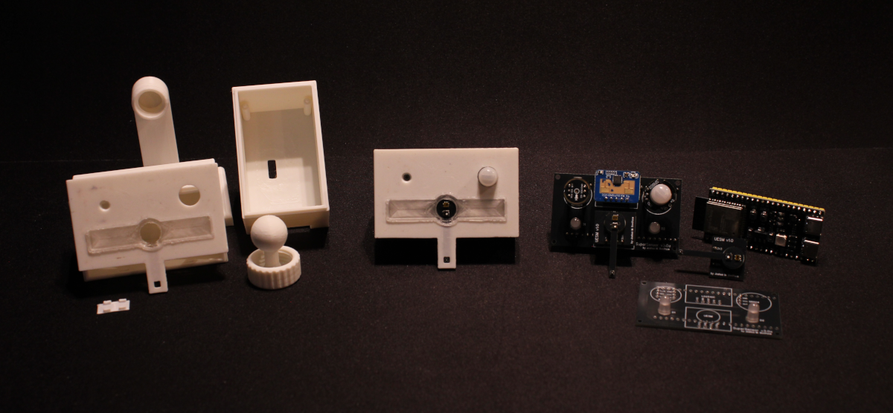
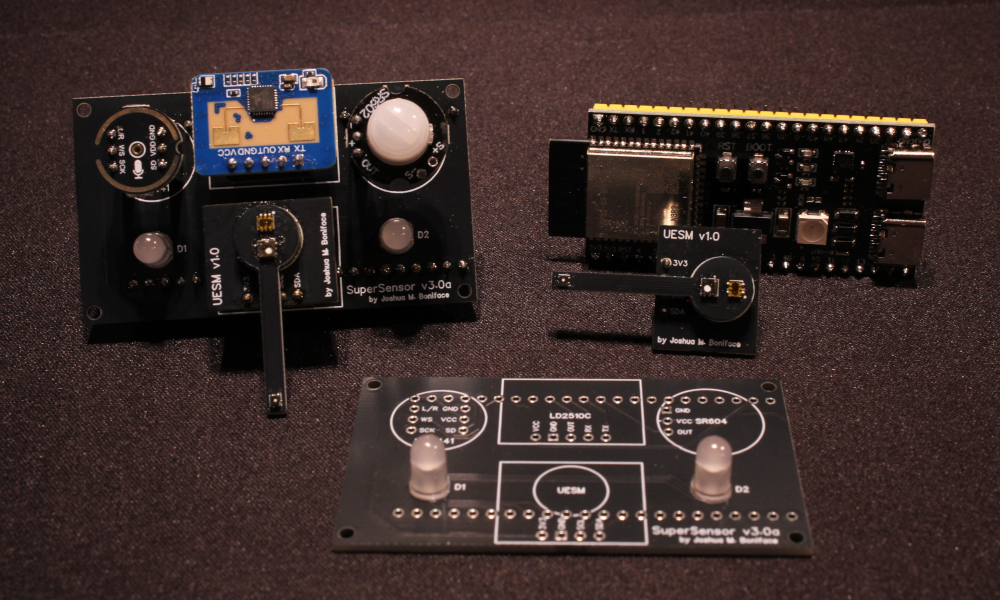
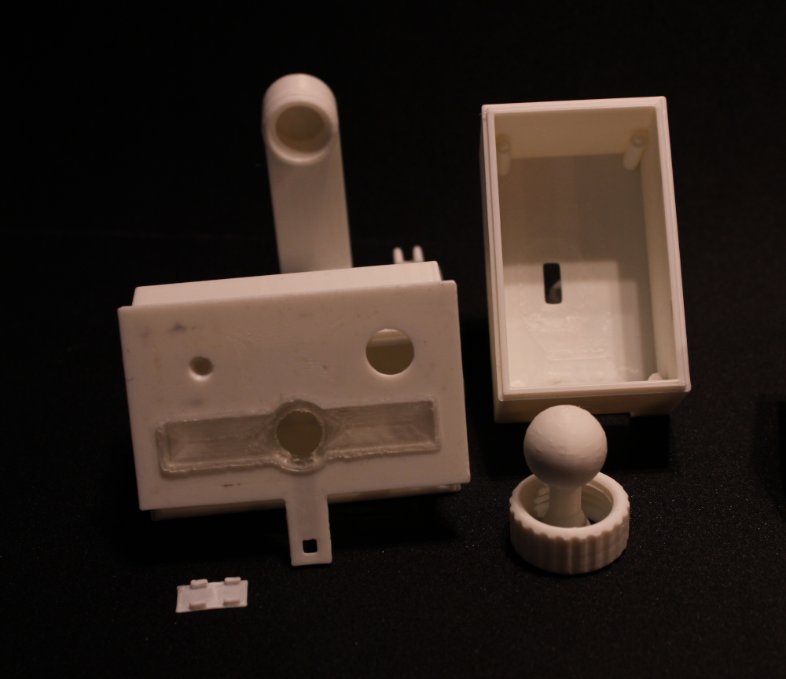
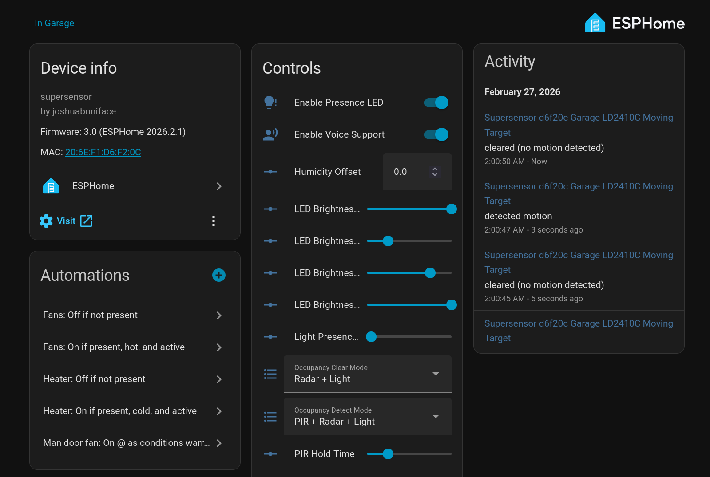

# SuperSensor v3.x

**NOTE:** The SuperSensor v3.x is still under development! Aspects of this branch may change at any time; please ignore it until this warning is removed!

The SuperSensor is a free-and-open-source multi-sensor array with voice control capabilities using ESPHome, designed for use with Home Assistant.

Inspired heavily by the EverythingSmartHome Everything Presence One sensor and the HomeAssistant "$13 Voice Assistant" project, its goals are to track human presence in a room using both millimetre-wave radar and passive infrared, provide voice control capabilities for Home Assistant Assist pipelines via a microphone and coloured feedback LEDs, and provide data on the room environment including temperature, humidity, VOC, eCO2, NOx, and light levels. It's based on the ESP32-S3 platform running ESPHome, providing plenty of power for all the demands of this sensor array.

If you want to automate your home and life with Home Assistant, the SuperSensor is the perfect tool for the job.

This branch is for version 3.x of the SuperSensor, the current version, based on the ESP32-S3 microcontroller and using our custom Unified Environment Sensor Module (UESM). For previous versions based on the ESP32 microcontroller, please see the [v2.x](https://github.com/joshuaboniface/supersensor/tree/v2.x) and [v1.x](https://github.com/joshuaboniface/supersensor/tree/v1.x) branches. Users new to the project should use v3.x exclusively as it has numerous improvements over the previous versions, even though it is more complicated to build.

For more information, please see the following:

 * The [blog post on v3.0](https://www.boniface.me/posts/the-supersensor-3.0)
 * The [introduction video]()
 * The PCB design details [in `board/`](board/) and on [OSHWLab](https://oshwlab.com/joshuaboniface/supersensor-3-0)
 * The case design details [in `case/`](case/) and on [TinkerCAD](https://www.tinkercad.com/things/gx66mJQMgR6)
 * Calibration and configuration instructions [in `configuration/`](configuration/).

## Table of Contents

* [Overview](#overview)
   * [Core Components](#core-components)
   * [Software](#software)
* [PCB Design & DIY](#pcb-design--diy)
   * [UESM Parts List](#uesm-parts-list)
   * [SuperSensor Parts List](#supersensor-parts-list)
   * [Case/Enclosure](#caseenclosure)
   * [Adopting, Calibrating, and Configuring](#adopting-calibrating-and-configuring)
* [More Information](#more-information)
   * [Contributing](#contributing)

# Overview

## Core Components

### ESP32-S3-N8R2 microcontroller

This microcontroller provides the "brains" of the SuperSensor. As the latest generation of high-performance microcontrollers in the ESP32 family, it contains many improvements on previous ESP32 chips, including better machine learning support for local OpenWakeWord detection, more memory for the Assist pipelines (fixing crashes in v2.x), and a nicer pin layout including better power delivery. We use unofficial modules here for cost savings, and the N8R2 configuration with additional flash and PSRAM is required due to specific configurations and pin assignments in the final design.

### HiLink HLK-LD2410C 24GHz radar module

This millimetre-wave radar module provides an excellent balance between form-factor, cost, reliability, and performance. It is capable of detecting human-like motion from 1-6m with configurable distance gates, and has served us reliably through all 3 versions of the SuperSensor.

### SR602 PIR module

This passive infrared module provides excellent value and a compatable form-factor for our purposes. It is capable of rapidly detecting human motion in front of the sensor.

### Custom "UESM" module

The custom-designed Unified Environment Sensor Module, or UESM, is the heart of the SuperSensor v3.x, combining 3 discrete environmental sensors into one convenient module.

* An AMS TSL2591 ambient light sensor providing both visible and infrared light levels, giving both an additional "presence" indicator and a general light level for automations.

* A Sensirion SGP41 VOC and NOx level sensor, giving air quality information with compensation from the SHT45.

* A Sensirion SHT45 high-precision temperature and humidity sensor, giving both these values as well as several computed values like absolute humidity and dew point, and placed on a descender to isolate it from the heat of the other components.

These 3 components are combined on a custom module featuring 3 stacked PCB levels. The pin connections and passive power circuitry (bottom, 3.3v **only**) are on the lower level, in a standard rectangular form factor on par with a standalone TSL2591 module. On top is a circular 1 cm diameter spacer PCB for added height, and finally above that is another circular 1 cm diameter PCB containing the 3 actual sensor modules on the top surface.

This design was created specifically due to the challenges of the SuperSensor: the sensors must be well outside the case and into the ambient environment to properly detect the environmental conditions and avoid being excessively influenced by the other components; and due to our case design, they must protrude a fair amount above the other sensor modules in the upper layer without obstructions from passive components, pins etc. affecting the top cover. The final sensor design provides a great solution to both problems.

### INMP441 MEMS microphone module

This basic microphone provides our voice interface input, listening for wake words continuously (local-only) as well as commands after detection (external processing to STT). The INMP441 is electrically simple and easy to use while still offering excellent performance.

### RGB LEDs x2

A pair of RGB LEDs provide active feedback for the voice interface, as well as for presence detection. When voice is idle and presence is detected, the LEDs will glow slightly (configurable); when voice control is active, the LEDs cycle through various colours to indicate status - blue for listening, cyan for processing, green for success, and red for failure (the latter two as reported by Home Assistant).

## Case/Enclosure

The case/enclosure for the SuperSensor is also provided under a compatible free-and-open-source license (Creative Commons Attribution-ShareAlike 4.0). It is mostly self-designed but contains elements from [Nikolay "darkfrei"'s Universal Ball Joint design](https://www.thingiverse.com/thing:6804839) for the mounting components.

The design features several main parts with individual STL files in [the `case/` directory](case/):

* a body with standoffs to hold the assembled PCB with USB connections on the right side (facing the sensor)
* a cover with holes for the microphone, the PIR cover, and the LED insert, with a descender to cover the UESM SHT45 sensor including a small back plate
* an LED insert diffuser with a hole for the UESM
* a wall-mount assembly featuring two 45+° ball joints for full articulation, with 3 separate mount point options (3M Command™ strip/double-sided tape, cable ties, or M4/#6 screws)
* a table-mount assembly featuring one 45+° ball joint and a flat bottom including cutouts for 4 ~13mm rubber anti-slip feet

For more details including important printing, assembly, and positioning guides, see the README in that directory.

## Software

The SuperSensor runs ESPHome, as this provides an excellent interface into Home Assistant as well as a standalone Web server, with excellent OTA update support and simple provisioning and onboarding. The config is provided, via this repo, as a standard package allowing seamless updates as new features, bugfixes, or other changes are developed, once the device is adopted into the ESPHome Companion module in Home Assistant.

The software stack and output sensors can be nicely mapped to the above hardware components, with some additional glue functionality added as well:

* A unified "occupancy" presence detection system, with configurable inbound and outbound detection options selecting from the radar, PIR, and light level sensors in various possible combinations. This provides a user with a great variety of options for controlling presence detection and clearing, as well as a single unified sensor for use in automations. On inbound, the occupancy is triggered by a logical "and" of the configured sensors (all must fire), while outbound is triggered by a logical "or" (any one clearing clears the occupancy); this allows for the configuration of very "safe" detection in both directions if needed, or simple fallback to a single mechanism in either direction.

* A "room health" sensor system, which provides a fully configurable merging of the various temperature, humidity, and air quality sensors into a single numerical (%) or text sensor providing the relative "health" or comfort level of a room, with 100% representing a perfect environment. All the parameters are configurable as required, to set exactly the specifications you desire in your room. For more details, see [the Room Health section of the configuration README](/configuration#room-health).

* The voice pipeline leverages Micro Wake Word with a decent number of wake words, including all the stock ESPHome/Home Assistant options and several choice inclusions from other repositories. The wake word is selectable at runtime, along with many other parameters allowing fine adjustment of the voice control to suit your needs. The voice control functionality can also be fully disabled with a single switch should this be desired.

* The LD2410C configuration is fully exposed, allowing easy tweaks of the parameters from within Home Assistant or ESPHome, including initial empty room calibration.

* The SHT45 and SGP41 values are averaged using a sliding window over 1 minute (15s sammples with 4 samples in a window) to balance long-term trends against short-term spikes.

A standard concept we've followed is that "if it can be configured at runtime, it should be exposed", so as much as possible about the sensor behaviour is configurable, giving the user maximum flexibility.

The entire software stack is licensed under the GNU GPL v3, qualifying fully as free-and-open-source software.

# PCB Design & DIY

The full hardware description is provided here, including all components and PCB designs, under a compatible free-and-open-source license (Creative Commons Attribution+ShareAlike 4.0).

The SuperSensor features 4 printed circuit boards: the main backplane board that connects the ESP32, sensor boards, LEDs, and their passive components; and 3 boards making up the UESM module (base, spacer, and top). Schematics and board definitions for EasyEDA can be found in [the `board/` directory](board/).

Below are full parts lists, along with pricing and links to the exact suppliers used to assemble our own sensors. PCB IDs are provided for easy reference; note that these IDs are for the [combined schematic](/board/schematic.svg) of both the UESM and main board and increment accordingly.

## UESM Parts List

**Note:** All prices are $CAD, as of late November 2025, excluding shipping, sales, and bulk discounts beyond those indicated.

**Note:** For AliExpress item links marked `*`, ensure you select the correct device; multiple different models share the page.

| Qty   | PCB ID(s) | Component                                      | Cost                | Links |
|-------|-----------|------------------------------------------------|---------------------|-------|
| 1     | N/A       | PCB - "UESM Base"                              | $0.21 ($5.20/25)    | [EasyEDA/JLCPCB](/board/pcb-uesm-base.easyeda.json) |
| 1     | N/A       | PCB - "UESM Spacer"                            | $0.22 ($5.30/25)    | [EasyEDA/JLCPCB](/board/pcb-uesm-spacer.easyeda.json) |
| 1     | N/A       | PCB - "UESM Top"                               | $0.22 ($5.30/25)    | [EasyEDA/JLCPCB](/board/pcb-uesm-top.easyeda.json) |
| 1     | U1        | Sensirion SHT45-AD1F-R2                        | $9.37               | [DigiKey.ca](https://www.digikey.ca/en/products/detail/sensirion-ag/SHT45-AD1F-R2/17180856) |
| 1     | U2        | Sensirion SGP41-D-R4                           | $13.00              | [DigiKey.ca](https://www.digikey.ca/en/products/detail/sensirion-ag/SGP41-D-R4/15652788) |
| 1     | U3        | AMS TSL25911FNCT-ND                            | $2.65               | [DigiKey.ca](https://www.digikey.ca/en/products/detail/ams-osram-usa-inc/TSL25911FN/4162547) |
| 2     | R1, R2    | CR1206-FX-4701ELFCT-ND (4.7KΩ 1% 1/4W 1206)    | $0.16               | [DigiKey.ca](https://www.digikey.ca/en/products/detail/bourns-inc/CR1206-FX-4701ELF/2563072) |
| 1     | R3        | CR1206-FX-10R0ELFCT-ND (10Ω 1% 1/4W 1206)      | $0.16               | [DigiKey.ca](https://www.digikey.ca/en/products/detail/bourns-inc/CR1206-FX-10R0ELF/2562695) |
| 1     | R4        | CR0603-JW-104ELFCT-ND (100KΩ 5% 1/10W 0603)    | $0.16               | [DigiKey.ca](https://www.digikey.ca/en/products/detail/bourns-inc/CR0603-JW-104ELF/2345098) |
| 1     | C1        | 399-C0805C106K8PACTUCT-ND (10μF 10V X5R 0805)  | $0.19               | [DigiKey.ca](https://www.digikey.ca/en/products/detail/kemet/C0805C106K8PACTU/1090830) |
| 1     | C2        | 399-C0805C104K5RACTUCT-ND (0.1μF 50V X7R 0805) | $0.12               | [DigiKey.ca](https://www.digikey.ca/en/products/detail/kemet/C0805C104K5RACTU/411169) |
| 1     | C3        | 399-C0805C105K3RACTUCT-ND (1μF 50V X7R 0805)   | $0.18               | [DigiKey.ca](https://www.digikey.ca/en/products/detail/kemet/C0805C105K3RACTU/2211765) |
| 1     | H1        | 2.54mm 1x4 male header                         | $0.05               | [AliExpress](https://www.aliexpress.com/item/4000988113226.html)* |
| **T** |           |                                                | **$26.85**          | *plus tools, solder, etc.* |

## SuperSensor Parts List

**Note:** All prices are $CAD, as of early December 2025, excluding shipping and bulk discounts.

**Note:** For AliExpress item links marked `*`, ensure you select the correct device; multiple different models share the page.

| Qty   | PCB ID(s) | Component                                           | Cost                | Links |
|-------|-----------|-----------------------------------------------------|---------------------|-------|
| 1     | N/A       | PCB - "SuperSensor"                                 | $0.35 ($8.70/25)    | [EasyEDA/JLCPCB](/board/pcb-supersensor.easyeda.json) |
| 1     | U4        | ESP32-S3-1-N8R2, unsoldered                         | $5.49               | [AliExpress](https://www.aliexpress.com/item/1005010056064272.html)* |
| 1     | U5        | UESM, unassembled                                   | $26.85              | *see above for individual component prices* |
| 1     | U6        | Hornaxys SR602 PIR                                  | $1.13 ($5.65/5)     | [AliExpress](https://www.aliexpress.com/item/1005006533504953.html) |
| 1     | U7        | HiLink HLK-LD2410C-P                                | $4.89               | [AliExpress](https://www.aliexpress.com/item/1005006000579211.html)* |
| 1     | U8        | INMP441                                             | $5.25               | [AliExpress](https://www.aliexpress.com/item/1005010338533932.html) |
| 2     | D1, D2    | Cleiscry 5mm diffused common-cathode RGB LED        | $0.09 ($9.12/100)   | [Amazon.ca](https://www.amazon.ca/dp/B09Y8M2PKS) |
| 2     | R5, R6    | 118-CR1206-FX-33R0ELFCT-ND (33Ω 1% 1/4W 1206)       | $0.16               | [DigiKey.ca](https://www.digikey.ca/en/products/detail/bourns-inc/CR1206-FX-33R0ELF/2562981) |
| 1     | C4        | 399-C0805C104K5RACTUCT-ND (0.1μF 50V X7R 0805)      | $0.12               | [DigiKey.ca](https://www.digikey.ca/en/products/detail/kemet/C0805C104K5RACTU/411169) |
| 3     | N/A       | 2.54mm 1x3 female header                            | $0.23 ($2.25/10)    | [AliExpress](https://www.aliexpress.com/item/4001198421663.html)* |
| 1     | N/A       | 2.54mm 1x4 female header                            | $0.21 ($2.12/10)    | [AliExpress](https://www.aliexpress.com/item/4001198421663.html)* |
| 1     | N/A       | 2.54mm 1x5 female header                            | $0.23 ($2.32/10)    | [AliExpress](https://www.aliexpress.com/item/4001198421663.html)* |
| 2     | N/A       | 2.54mm 1x22 female header                           | $0.31 ($3.14/10)    | [AliExpress](https://www.aliexpress.com/item/4001198421663.html)* |
| **T** |           |                                                     | **$46.33**          | *plus tools, solder, etc.* |

**Note:** For the ESP32-S3-N8R2-DevKitC-1 to function properly as a 5V power source for other components (i.e. the LD2410C and SR602) within the SuperSensor, you must bridge the "In-Out" jumper on the front of the PCB near pins 11 and 12. This bypasses a protection diode preventing the 5Vin pin from backfeeding power into the circuit, but also enables us to get an actual 5V off the pin.

## Adopting, Calibrating, and Configuring

To adopt a SuperSensor into your Home Assistant:

1. Power on the device.
2. Using your smartphone, connect to the open wireless access point named `supersensor-XXXXXX`, where `XXXXXX` is the 6-character SuperSensor ID.
3. Follow the captive portal signon page and enter your WiFi credentials; the SuperSensor will connect to your WiFi network.
4. Navigate to the ESPHome Builder tab in Home Assistant. The SuperSensor should become visible as a discovered device.
5. Click "Take Control", and install the generated configuration. Once finished, edit the configuration and copy the API encryption key.
   **Note:** We recommend NOT setting a "Friendly Name" at this time to ensure that entity IDs do not contain the "friendly name" (e.g. `supersensor_XXXXXX_my_name_sht45...` instead of `supersensor_XXXXXX_sht45...`).
6. Navigate to Settings -> Devices & Services; the SuperSensor should appear at the top; click "Add", then when prompted enter the API key. The device should now be visible in your system.
7. You can now customize the name suffix in the ESPHome Builder configuration by adding to the "Friendly Name" field, e.g. "SuperSensor XXXXXX Living Room", to give it a clearer name.
8. All entities should be available in the form `<type>.supersensor_XXXXXX_<name>` within your automations and cards.
9. If desired, you can obtain a "Location Name" entity by creating a template sensor helper with the following details:
   * Name: `SuperSensor XXXXXX Device Location Name`
   * State: `{{ device_attr('binary_sensor.supersensor_XXXXXX_supersensor_occupancy', 'name')|replace('Supersensor XXXXXX ', '') }}`
   * Device: `SuperSensor XXXXXX ...`

The SuperSensor provides a very wide array of configurable options. We also provide a convenient templatable dashboard which neatly organizies the various configuration options and sensor outputs for easy display and configuration of multiple SuperSensors in your Home Assistant configuration.

The SuperSensor requires [two main pieces of calibration](configuration#calibration) before being truly usable:

* Calibration of the HLK-LD2410C to properly detect presence in a room.

* Calibration of the SHT45 temperature sensor. The default Temperature Offset value of `-2.0` should be accurate enough for most users, though a SuperSensor in a steady airstream may need a higher (closer to `0.0`) value.

In addition, we also provide a [helpful, templatable Dashboard](configuration#dashboard) for all your SuperSensors leveraging the [decluterring card from HACS](https://github.com/custom-cards/decluttering-card).

For more details on these options and steps, please see [the `configuration/` directory](configuration/).

# More Information

For more information please feel free to reach out, or open an issue.

## Contributing

If you wish to contribute to the SuperSensor project, please open a pull request in this repository. All pull requests will be carefully reviewed before inclusion, as we are extremely selective about what we modify.

Please ensure you target the correct branch(es) for your changes. Currently we are supporting both `v2.x` and `v3.x` in software, while `v1.x` is deprecated, and there is no `master`/`main` branch. This support of both `v2.x` and `v3.x` means a 1-to-1 correlation of functionality between those two versions, so any PR to one will be back- or forward-ported to the other, and your changes(s) must be compatable with both.

Any changes must be **globally applicable to all users** of the project; if you wish to maintain your own customizations that are only applicable for yourself, please fork the project and adjust your package import URL accordingly.

"AI" (LLM) contributions are not prohibited, but you - a human - **must** at least review, reformat, and test the changes yourself before submitting them. Obviously pure-LLM-generated PRs that do not function, mangle formatting or functionality, or otherwise clearly have no human review will be rejected with prejudice. This extends to the PR body itself: write in your own words, not the output of an LLM, and if you can't concisely sumarize the changes yourself, then we're not interested in them.
