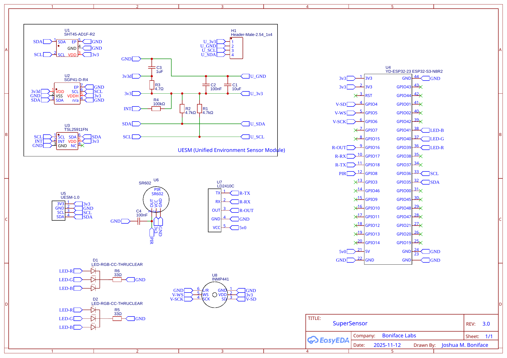
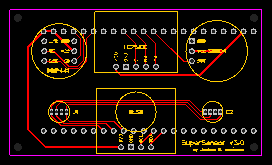
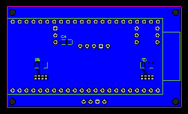
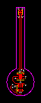
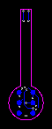
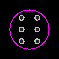
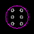
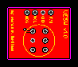
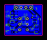

# SuperSensor v3.x Board Designs

This is a collection of [EasyEDA](https://easyeda.com/) schematics and board desgins for the SuperSensor v3.x's components.

The design features several individual parts:

* A core SuperSensor board which ties the various components together.
* The UESM comprising three discrete boards.

You can import the design definition files (`*.easyeda.json`) directly into EasyEDA via "File" -> "Open" -> "EasyEDA". The schematic is provided for reference in both EasyEDA and SVG formats; if you just wish to manufacture the boards, you only need to import the board definitions, then via "Fabrication" -> "One-click Order PCB/SMT" complete the order at [JLCPCB](https://jlcpcb.com). We order all boards in a black silkscreen with lead-free HASL (for use with low-temperature Ga-Sn solder paste) and all other options as default.

You can also see the designs directly on [OSHWLab here](https://oshwlab.com/joshuaboniface/supersensor-3-0).

The board design and images in this folder are © 2025 [Joshua M. Boniface](https://www.boniface.me) and licensed under the [Creative Commons Attribution-ShareAlike (BY-SA) 4.0](LICENSE) license.

* [Schematic](#schematic)
* [Boards](#boards)
* [Assembly](#assembly)

## Schematic

The schematic is visible here in SVG format, and also as an EasyEDA definition in [schematic.easyeda.json](schematic.easyeda.json).

The individual parts can be found, with their labels (`R1`, etc.) in the [main README parts list](https://github.com/joshuaboniface/supersensor/tree/v3.x?tab=readme-ov-file#pcb-design--diy).

## Boards

There are 4 boards; 1 for the main SuperSensor and 3 for the Unified Environment Sensor Module (UESM).

### SuperSensor

This is the main board of the SuperSensor, which connects the ESP32-S3, modules, LEDs, and passive components and provides a structural mount to the case via four corner mounting holes.

### UESM Top

This is the top board of the Unified Environment Sensor Module (UESM) which contains the main sensors (SHT45, SGP41, and TSL2591) on its top surface; it connects to the following boards via surface pads on the bottom.

The board features a long component to house the SHT45 sensor, protruding it approximately 20cm downward out of the main case body, in order to properly isolate the sensor from internal heating.

### UESM Spacer

This is the middle board of the UESM, which serves only as a pass-through spacer to extend the height of the top board by a further 1.6mm, allowing that board to cleanly protrude past the connector pin tops and out of the case top.

### UESM Base

This is the main board of the UESM, which connects to the main PCB with a standard 3.3V-only I²C 4-pin header. It features all the passive components for driving the 3 sensor modules on the bottom, while the top is occupied by the connections to the upper boards.

## Assembly

### UESM

**Warning**: Assembly of the UESM is not for the faint of heart. It requires a steady hand and very gentle application of heat. Follow these directions exactly for success. We also offer [UESM modules for sale]() if this feels too daunting but you wish to DIY the rest of the project.

To assembly the UESM you will need, in addition to the listed components in the main README, the following:

* Isopropyl alcohol (99% ideal) and paper towel.
* Low-temperature (138°C SnGa) solder paste (for delicate SMD components).
* Normal (PbSn) solder (for the final pin headers, if you wish).
* A hot air reflow station, and optionally a hotplate, with precise temperature control.
* A soldering iron with a (semi-)fine tip.
* A set of helping hands (aligator clips on adjustable extensions).
* Two pairs of fine precise tweezers.
* A temperature-safe soldering work area.

There are two processes possible - a more manual process using only hot air, and a process using both a hotplate and hot air. The latter is far less error prone and more forgiving, but requires a suitable hotplate. The steps for both are fundamentally the same, the only difference being the use of the hotplate to perform the component soldering on the `top` and `bottom` boards; we leave it up to the reader to reinterpret the hot-air only instructions below in this regard. Both processes require hot air for joining the two pieces.

Before proceeding, clean all PCBs thoroughly with isopropyl alcohol and paper towel.

The assembly proceeds in three steps: first the assembly of the `top` board's top surface components (sensors), then the assembly of the `bottom` board's bottom surface components (passives), then finally the joining of both boards with the spacer.

##### `top` PCB

1. Take a `top` PCB and place it into the helping hands by its edge, with the component side facing up and the pad side facing down.

2. Carefully apply a very small amount of solder paste to each top surface pad. If you think it's not enough, it's just right. We found a stencil more cumbersome than it was worth and just use a hyper-fine sringe tip on the solder paste along with careful concentration. Place each component onto its pads with tweezers.

3. Heat the hot air station to 240C; no higher. Apply heat to the **bottom** of the `top` PCB until all the solder reflows. Check carefully for any bridges or failed joins and gently reflow in the same way as necessary. **Never apply heat directly to the sensors themselves!**

4. Wait for the board to cool.

##### `base` PCB

1. Take a `base` PCB and place it flat on your work surface, component-side (bottom) up.

2. Apply a fair amount of solder paste to each component pad, ensuring enough coverage for the components to firmly sit into the paste. Place each component onto its pads with tweezers.

3. Heat the hot air station to 240-260C. Apply heat directly to each component until all the solder reflows. Check carefully for any bridges or failed joins and gently reflow as necessary.

4. Wait for the board to cool.

5. Insert the 4-pin header into place, and flip the PCB around.

6. Using a standard soldering iron and solder, solder the pins into place. Note that due to the `top` PCB design, you **must** solder on these pins now, before joining the `top` and `base` PCBs.

##### Joining

**Note:** This step can be very finicky. Patience, a steady hand, and a careful eye is required.

1. Inset the `base` PCB by its pins into the helping hands so that it is securely held and sitting flat with its top surface up (components down), and so that the board is "face up" to you (pins furthest away).

2. Place a liberal amount of solder paste onto each of the bridge holes, starting with a spiral slightly outside of the edge of the castellation, and working inwards.

3. Take a `spacer` PCB, and place it on top of the `base` PCB, carefully aligning each hole and ensuring straightness.

4. Heat the hot air station to 240-260C. Apply heat to the top of the `spacer` PCB while gently pressing down with tweezers, until the two PCBs join flat and make a good solder connection on each pin. Verify electrical connectivity to be certain.

5. Repeat the process in step 2 with the `spacer` PCB.

6. Take the completed `top` PCB, and place it on top of the `spacer` PCB, carefully aligning each hole and ensuring straightness. There will likely be a gap on the side closes to you as the arm rests on the pin protrusions; this is normal.

7. Heat the hot air station to 240-260C. Apply heat to the **bottom** of the `base` PCB. It will take a little time for all the boards to heat and the solder paste to begin to melt.

8. When the paste begins to melt, start pressing down lightly on the top of the `top` PCB with tweezers, to ensure the boards join. It should be clear once they do as the `top` PCB will now "want" to sit flush with the `spacer` PCB and not fall.

9. Remove the heat, and acting quickly, ensure correct alignment of the circular PCB components with each other and with the printed ring on the `base` PCB, and of the extension of the `top` PCB; it should be exactly parallel to the short edges of the `base` PCB. Use the tweezers to **gently** nudge it from the sides at its far end to align it; the solder and flux may fight you slightly, but this helps ensure good alignment.

10. Let the entire assembly cool fully and inspect it visually for any deficiencies, specifically for any component misalignment on the bottom of the `base` PCB due to heat application in steps 7-9.

11. Perform final electrical tests, ensuring that the `3V3`, `GND`, `SDA`, and `SCL` signals fully reach from the pins to the contact points on the SHT45 sensor.

The UESM is now fully assembled and ready for final testing and insertion into a SuperSensor.

##### Troubleshooting

If you find there are inter-board connectivity issues, the most likely cause is insufficient solder paste bridging the PCB boads. To solve this you can do the following:

1. Re-apply heat as in step 7 of the `Joining` process until the joins between the boards weakens.

2. Remove the `top` PCB, leaving the `spacer` and `base` boards together, and apply additional solder paste to the pads on the bottom of the `top` PCB.

3. Repeat steps 6-9 of the `Joining` process until the boards are re-joined and aligned. Retest electrical connectivity and repeat if necessary.

4. Clean up any extra solder that has flowed out of the `base` PCB's holes with careful application of heat.

### SuperSensor

To assembly the SuperSensor you will need, in addition to the listed components in the main README, the following:

* Isopropyl alcohol (99% ideal) and paper towel.
* Normal (PbSn) solder or low-temperature (138°C SnGa) solder paste (if lead-free is desired).
* A soldering iron with a (semi-)fine tip.
* A set of helping hands (aligator clips on adjustable extensions).
* A temperature-safe soldering work area.

Assembly of this module is fairly straightforward and aside from 3 SMD components is all through-hole. The SMD components are relatively large and can be soldered using normal solder and a soldering iron one edge at a time, though if you have low-temperature solder paste from the UESM assembly you may use that along with hot air to reflow them instead.

1. Clean the PCB thoroughly with isopropyl alcohol and paper towel.

2. Solder on the 3 SMD passive components (C4, R5, & R6); if using solder paste, leverage hot air or a hotplate, or carefully use a solder iron with a fine tip.

3. Insert the LEDs into their holes, carefully noting the direction and aligning the flat side with the silkscreen. Solder in the leads carefully using a fine tip to avoid bridges, and trim off the excess leads.

4. Place the 3-, 4-, and 5-pin female connectors from the front of the PCB, then solder them in from the back of the PCB. Use another board or flat surface as a stabilizer as needed. Always solder one pin first, check alignment, then solder the remaining pins.

5. Place the 22-pin female connectors from the back of the PCB, then solder them in from the front of the PCB. Use the ESP32 module as a positioning guide as required; we tend to solder both the pins to the ESP, and the connectors to the board, at the same time, starting with the four corners for stability and then proceeding down the rows.

6. Bridge the "In-Out" jumper on the front of ESP32-S3 module with solder, located on the front of the ESP32-S3 PCB near pins 11 and 12, to enable 5V output on the 5Vin pin.

7. Insert the remaining components into their respective connectors.

8. Connect the board via USB to your computer using the USB-C connector labeled "COM" (the bottom of the two when the sensor is upright). Using the ESPHome software, flash the `supersensor.yaml` configuration onto the ESP32. **Note:** Sometimes, you may need to reset the board into bootloader mode by holding the "Boot" button and simultaneously pressing the "Rst" button, in order to apply the configuration. Once finished, press the "Rst" button again to boot into normal mode.

9. Verify functionality via the console log (using `esphome logs supersensor.yaml` if disconnected in the previous step), ensuring that all components are detected and begin reporting data.

10. Adopt the completed SuperSensor onto your WiFi network and add it to Home Assistant.

11. Place the SuperSensor into the [case](../case) and mount it in your desired location. Use the USB-C connector labeled "USB" (the top of the two when the sensor is upright) for power in normal usage.
