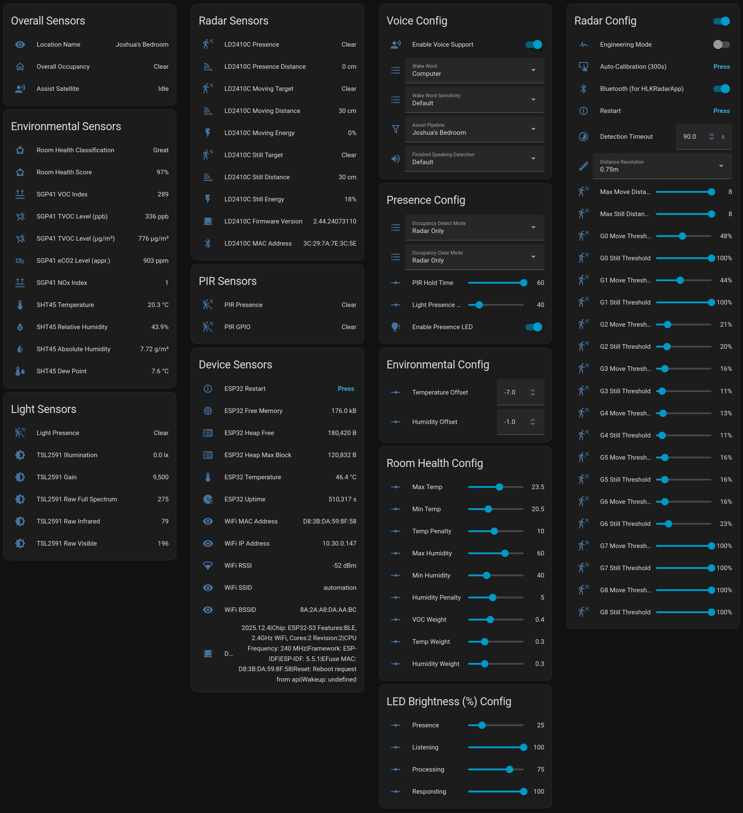

# SuperSensor v3.x Calibration & Configuration

This page details the calibration steps for a SuperSensor v3.x, as well as all the available configurable options and sensor entities. It can be used as a standard reference both for initial deployments and future tweaks or modifications to the configuration.

* [Calibration](#calibration)
   * [HLK-LD2410C Radar Sensor](#hlk-ld2410C-radar-sensor)
   * [SHT45 Temperature Sensor](#sht45-temperature-sensor)
* [Dashboard](#dashboard)
* [Configuration Entities](#configuration)
   * [Presence](#presence)
   * [Environment](#environment)
   * [Voice Assistant & Response](#voice-assistant--response)
   * [LD2410C Radar](#ld2410c-radar)
* [Sensor Entities](#sensors)
   * [Overall/Device Sensors](#overalldevice-sensors)
   * [Environmental Sensors](#environmental-sensors)
   * [Light Sensors](#light-sensors)
   * [Radar Sensors](#radar-sensors)
   * [PIR Sensors](#pir-sensors)

## Calibration

The SuperSensor requires two main pieces of calibration before being truly usable: configuration of the HLK-LD2410C radar sensor, and configuration of the "Temperature Offset" value for the SHT45 temperature/humidity sensor.

### HLK-LD2410C Radar Sensor

The SuperSensor features the ability to automatically calibrate the HLK-LD2410C from within Home Assistant. This can avoid the need for an external app, though advanced users may still wish to use the "HLKRadarTool" app ([Google Play](https://play.google.com/store/apps/details?id=com.hlk.hlkradartool)/[Apple AppStore](https://apps.apple.com/us/app/hlkradartool/id1638651152)) for more careful tweaking. We will not touch on the details of that app here, as there are other guides available from e.g. [DroneBot Workshop](https://dronebotworkshop.com/ld2410c-human-sensor/) and [Screek Workshop](https://screek.io/gen1) for those wishing to know more.

Without calibration, the default values of the HLK-LD2410C presence gates are likely not accurate for your room environment, which can result in missed triggers if they are not sensitive enough, or false triggers if they are too sensitive. This process will ensure your sensors are calibrated to a good baseline of known radar reflections in an empty room, from which you can slightly tweak the values for more accurate presence detection.

   **Note:** Keep in mind that due to its mode of operation, non-human objects in the detection range that move with roughly the frequency of human breating (0-5 Hz), such as fans, curtains, etc. will negatively affect the radar detection capabilities, triggering false detection. Take care to account for this in your placement of the sensor and during your calibration. The biggest culprits in our experience are ceiling fans and oscillating fans, as well as curtains blowing in the breeze by an open window. If you find this happening, adjust your triggering gates higher accordingly, or move the sensor so that they are outside of the main line of sight or in a distance gate you do not otherwise care about.

1. Enable the "LD2410C Engineering Mode" switch. This will activate the various "LD2410C GX Move/Still Energy" sensors to see individual gate activity.

2. Clear/clean the room of any moving objects, people, etc. that may interfere with the calibration. Exit the room yourself.

3. Press the "LD2410C Calibration" button. This will wait 10 seconds, then perform a 300 second base noise calibration routine on the HLK-LD2410C, then finally refresh the "LD2410C GX Move/Still Threshold" number values in ESPHome/Home Assistant.

4. Check the configured values for the various "LD2410C GX Move/Still Threshold" numbers, and optionally increase them slightly to account for variations. We usually round up to the nearest 5 or 10 depending on how noisy the gate is, except in situations where exact values matter (e.g. detecting sleeping presence where 1-2 can make a difference).

5. Check the behaviour by entering the room and observing the sensor outputs. Ensure that your standard movements and stationary locations adequately trigger the various gates and overall presence indication.

6. Adjust the "LD2410C Timeout" to provide a good timeout value for your environment; we tend to use somewhere from 30 to 90 seconds, though up to 300 seconds can be useful in places where occupants are stationary (sleeping, sitting for extended periods, etc.). Note that retriggers within this timeout will ensure occupancy remains active, so set this based on your expected use: it should be high enough to capture low-movement stationary situations like sleeping, while more active areas can do with lower values.

7. Continue to observe the "LD2410C GX Move/Still Energy" and overall occupancy sensors for a few days with the "LD2410C Engineering Mode" switch still on, to ensure that the sensor is behaving correctly. You may need to tweak the individual gate values further as time goes on and the environment changes.

7. Disable the "LD2410C Engineering Mode" switch or press the "LD2410C Restart" button to perform a clean reset. Your radar presence sensor is now configured. If you ever move the SuperSensor again, repeat this process to ensure accurate calibration in the new field of view.

### SHT45 Temperature Sensor

The SuperSensor exposes "Temperature Offset" (ΔT) and "[Relative] Humidity Offset" (ΔRH) calibration values which allow you to specify an offset to the raw SHT45 Temperature/Relative Humidity values. This is needed due to the heat produced by other components in the SuperSensor such as the ESP32 and the LD2510C affecting the SHT45 sensor, especially when enclosed in the case, as well as drift between individual sensors. These offset values are configurable in the range from -30°C to +10°C and -40% to +40%, respectively.

The SuperSensor has a default ΔT value of `-2.0`. This has been found through extensive testing to be reasonably accurate for most home environments and sufficiently accurate for useful automations, when using the SuperSensor with its included case. The default ΔRH value is `0.0`, as we have found most SHT45 sensors to be quite accurate here, though outliers exist and this can be useful for such sensors.

Note however that the ΔT can drift in steady airflow such as a direct fan airstream, due to additional cooling of the case (and thus, internal heat sources). In such cases, an offset closer to `0.0` might be warranted. Experiment with the sensor in your environment using an external reference temperature to be sure; if you need a reference, we recommend our [Microenv sensor solution](https://github.com/joshuaboniface/microenv) as it features the same sensors in a carefully calibrated configuration for optimal temperature accuracy. Avoid fretting too much about <1° of offset, as this can be an exercise in frustration (trust us); adjust this only when the conditions are persistent (e.g. you've mounted the SuperSensor over an air purifier that is always on).

## Dashboard

We provide a helpful dashboard which combines all the (relevant) sensors and configurations below into a single page, leveraging the [decluttering card from HACS](https://github.com/custom-cards/decluttering-card) to support multiple SuperSensors without much hassle.



Add this to a new dashboard to begin, then add a section for each SuperSensor you wish to manage, replacing the `XXXXXX` and `YYYYYY` with your SuperSensor IDs.

```
###                                   ###
### Decluttering Template Definitions ###
###                                   ###
decluttering_templates:
  supersensor_overall:
    card:
      type: entities
      title: Overall Sensors
      entities:
        - entity: sensor.supersensor_[[supersensor_id]]_device_location_name
          name: Location Name
        - entity: binary_sensor.supersensor_[[supersensor_id]]_supersensor_occupancy
          name: Overall Occupancy
        - entity: assist_satellite.supersensor_[[supersensor_id]]_assist_satellite
          name: Assist Satellite
  supersensor_env:
    card:
      type: entities
      title: Environmental Sensors
      entities:
        - entity: sensor.supersensor_[[supersensor_id]]_room_health
          name: Room Health Classification
        - entity: sensor.supersensor_[[supersensor_id]]_room_health_score
          name: Room Health Score
        - entity: sensor.supersensor_[[supersensor_id]]_sgp41_voc_index
          name: SGP41 VOC Index
        - entity: sensor.supersensor_[[supersensor_id]]_sgp41_tvoc_ppb
          name: SGP41 TVOC Level (ppb)
        - entity: sensor.supersensor_[[supersensor_id]]_sgp41_tvoc_mg_m3
          name: SGP41 TVOC Level (µg/m³)
        - entity: sensor.supersensor_[[supersensor_id]]_sgp41_eco2_appr
          name: SGP41 eCO2 Level (appr.)
        - entity: sensor.supersensor_[[supersensor_id]]_sgp41_nox_index
          name: SGP41 NOx Index
        - entity: sensor.supersensor_[[supersensor_id]]_sht45_temperature
          name: SHT45 Temperature
        - entity: sensor.supersensor_[[supersensor_id]]_sht45_relative_humidity
          name: SHT45 Relative Humidity
        - entity: sensor.supersensor_[[supersensor_id]]_sht45_absolute_humidity
          name: SHT45 Absolute Humidity
        - entity: sensor.supersensor_[[supersensor_id]]_sht45_dew_point
          name: SHT45 Dew Point
  supersensor_light:
    card:
      type: entities
      title: Light Sensors
      entities:
        - entity: binary_sensor.supersensor_[[supersensor_id]]_light_presence
          name: Light Presence
        - entity: sensor.supersensor_[[supersensor_id]]_tsl2591_illumination
          name: TSL2591 Illumination
        - entity: sensor.supersensor_[[supersensor_id]]_tsl2591_gain
          name: TSL2591 Gain
        - entity: sensor.supersensor_[[supersensor_id]]_tsl2591_raw_full_spectrum
          name: TSL2591 Raw Full Spectrum
        - entity: sensor.supersensor_[[supersensor_id]]_tsl2591_raw_infrared
          name: TSL2591 Raw Infrared
        - entity: sensor.supersensor_[[supersensor_id]]_tsl2591_raw_visible
          name: TSL2591 Raw Visible
  supersensor_radar:
    card:
      type: entities
      title: Radar Sensors
      entities:
        - entity: binary_sensor.supersensor_[[supersensor_id]]_ld2410c_presence
          name: LD2410C Presence
        - entity: sensor.supersensor_[[supersensor_id]]_ld2410c_presence_distance
          name: LD2410C Presence Distance
        - entity: binary_sensor.supersensor_[[supersensor_id]]_ld2410c_moving_target
          name: LD2410C Moving Target
        - entity: sensor.supersensor_[[supersensor_id]]_ld2410c_moving_distance
          name: LD2410C Moving Distance
        - entity: sensor.supersensor_[[supersensor_id]]_ld2410c_move_energy
          name: LD2410C Moving Energy
        - entity: binary_sensor.supersensor_[[supersensor_id]]_ld2410c_still_target
          name: LD2410C Still Target
        - entity: sensor.supersensor_[[supersensor_id]]_ld2410c_still_distance
          name: LD2410C Still Distance
        - entity: sensor.supersensor_[[supersensor_id]]_ld2410c_still_energy
          name: LD2410C Still Energy
        - entity: sensor.supersensor_[[supersensor_id]]_ld2410c_firmware_version
          name: LD2410C Firmware Version
        - entity: sensor.supersensor_[[supersensor_id]]_ld2410c_mac_address
          name: LD2410C MAC Address
  supersensor_pir:
    card:
      type: entities
      title: PIR Sensors
      entities:
        - entity: binary_sensor.supersensor_[[supersensor_id]]_pir_presence
          name: PIR Presence
        - entity: binary_sensor.supersensor_[[supersensor_id]]_pir_gpio
          name: PIR GPIO
  supersensor_device:
    card:
      type: entities
      title: Device Sensors
      show_header_toggle: false
      entities:
        - entity: button.supersensor_[[supersensor_id]]_esp32_restart
          name: ESP32 Restart
        - entity: sensor.supersensor_[[supersensor_id]]_esp32_free_memory
          name: ESP32 Free Memory
        - entity: sensor.supersensor_[[supersensor_id]]_esp32_heap_free
          name: ESP32 Heap Free
        - entity: sensor.supersensor_[[supersensor_id]]_esp32_heap_max_block
          name: ESP32 Heap Max Block
        - entity: sensor.supersensor_[[supersensor_id]]_esp32_temperature
          name: ESP32 Temperature
        - entity: sensor.supersensor_[[supersensor_id]]_esp32_uptime
          name: ESP32 Uptime
        - entity: sensor.supersensor_[[supersensor_id]]_wifi_mac_address
          name: WiFi MAC Address
        - entity: sensor.supersensor_[[supersensor_id]]_wifi_ip_address
          name: WiFi IP Address
        - entity: sensor.supersensor_[[supersensor_id]]_wifi_rssi
          name: WiFi RSSI
        - entity: sensor.supersensor_[[supersensor_id]]_wifi_ssid
          name: WiFi SSID
        - entity: sensor.supersensor_[[supersensor_id]]_wifi_bssid
          name: WiFi BSSID
        - entity: sensor.supersensor_[[supersensor_id]]_device_info
          name: Device Info
  supersensor_voice_config:
    card:
      type: entities
      title: Voice Config
      entities:
        - entity: switch.supersensor_[[supersensor_id]]_enable_voice_support
          name: Enable Voice Support
        - entity: select.supersensor_[[supersensor_id]]_wake_word_selector
          name: Wake Word
        - entity: select.supersensor_[[supersensor_id]]_wake_word_sensitivity
          name: Wake Word Sensitivity
        - entity: select.supersensor_[[supersensor_id]]_assistant
          name: Assist Pipeline
        - entity: select.supersensor_[[supersensor_id]]_finished_speaking_detection
          name: Finished Speaking Detection
  supersensor_presence_config:
    card:
      type: entities
      title: Presence Config
      entities:
        - entity: select.supersensor_[[supersensor_id]]_occupancy_detect_mode
          name: Occupancy Detect Mode
        - entity: select.supersensor_[[supersensor_id]]_occupancy_clear_mode
          name: Occupancy Clear Mode
        - entity: number.supersensor_[[supersensor_id]]_pir_hold_time
          name: PIR Hold Time
        - entity: number.supersensor_[[supersensor_id]]_light_presence_threshold
          name: Light Presence Threshold
        - entity: switch.supersensor_[[supersensor_id]]_enable_presence_led
          name: Enable Presence LED
  supersensor_env_config:
    card:
      type: entities
      title: Environmental Config
      entities:
        - entity: number.supersensor_[[supersensor_id]]_temperature_offset
          name: Temperature Offset
        - entity: number.supersensor_[[supersensor_id]]_humidity_offset
          name: Humidity Offset
  supersensor_room_health_config:
    card:
      type: entities
      title: Room Health Config
      entities:
        - entity: number.supersensor_[[supersensor_id]]_room_health_max_temperature
          name: Max Temp
        - entity: number.supersensor_[[supersensor_id]]_room_health_min_temperature
          name: Min Temp
        - entity: >-
            number.supersensor_[[supersensor_id]]_room_health_temperature_penalty
          name: Temp Penalty
        - entity: number.supersensor_[[supersensor_id]]_room_health_max_humidity
          name: Max Humidity
        - entity: number.supersensor_[[supersensor_id]]_room_health_min_humidity
          name: Min Humidity
        - entity: number.supersensor_[[supersensor_id]]_room_health_humidity_penalty
          name: Humidity Penalty
        - entity: number.supersensor_[[supersensor_id]]_room_health_voc_weight
          name: VOC Weight
        - entity: number.supersensor_[[supersensor_id]]_room_health_temperature_weight
          name: Temp Weight
        - entity: number.supersensor_[[supersensor_id]]_room_health_humidity_weight
          name: Humidity Weight
  supersensor_led_config:
    card:
      type: entities
      title: LED Brightness (%) Config
      entities:
        - entity: number.supersensor_[[supersensor_id]]_led_brightness_presence
          name: Presence
        - entity: number.supersensor_[[supersensor_id]]_led_brightness_listening
          name: Listening
        - entity: number.supersensor_[[supersensor_id]]_led_brightness_processing
          name: Processing
        - entity: number.supersensor_[[supersensor_id]]_led_brightness_responding
          name: Responding
  supersensor_radar_config:
    card:
      type: entities
      title: Radar Config
      entities:
        - entity: switch.supersensor_[[supersensor_id]]_ld2410c_engineering_mode
          name: Engineering Mode
        - entity: switch.supersensor_[[supersensor_id]]_ld2410c_bluetooth
          name: LD2410C Bluetooth
        - entity: button.supersensor_[[supersensor_id]]_ld2410c_restart
          name: LD2410C Restart
        - entity: number.supersensor_[[supersensor_id]]_ld2410c_timeout
          name: Timeout
        - entity: select.supersensor_[[supersensor_id]]_ld2410c_distance_resolution
          name: Distance Resolution
        - entity: number.supersensor_[[supersensor_id]]_ld2410c_max_move_distance_gate
          name: Max Move Distance Gate
        - entity: >-
            number.supersensor_[[supersensor_id]]_ld2410c_max_still_distance_gate
          name: Max Still Distance Gate
        - entity: number.supersensor_[[supersensor_id]]_ld2410c_g0_move_threshold
          name: G0 Move Threshold
        - entity: number.supersensor_[[supersensor_id]]_ld2410c_g0_still_threshold
          name: G0 Still Threshold
        - entity: number.supersensor_[[supersensor_id]]_ld2410c_g1_move_threshold
          name: G1 Move Threshold
        - entity: number.supersensor_[[supersensor_id]]_ld2410c_g1_still_threshold
          name: G1 Still Threshold
        - entity: number.supersensor_[[supersensor_id]]_ld2410c_g2_move_threshold
          name: G2 Move Threshold
        - entity: number.supersensor_[[supersensor_id]]_ld2410c_g2_still_threshold
          name: G2 Still Threshold
        - entity: number.supersensor_[[supersensor_id]]_ld2410c_g3_move_threshold
          name: G3 Move Threshold
        - entity: number.supersensor_[[supersensor_id]]_ld2410c_g3_still_threshold
          name: G3 Still Threshold
        - entity: number.supersensor_[[supersensor_id]]_ld2410c_g4_move_threshold
          name: G4 Move Threshold
        - entity: number.supersensor_[[supersensor_id]]_ld2410c_g4_still_threshold
          name: G4 Still Threshold
        - entity: number.supersensor_[[supersensor_id]]_ld2410c_g5_move_threshold
          name: G5 Move Threshold
        - entity: number.supersensor_[[supersensor_id]]_ld2410c_g5_still_threshold
          name: G5 Still Threshold
        - entity: number.supersensor_[[supersensor_id]]_ld2410c_g6_move_threshold
          name: G6 Move Threshold
        - entity: number.supersensor_[[supersensor_id]]_ld2410c_g6_still_threshold
          name: G6 Still Threshold
        - entity: number.supersensor_[[supersensor_id]]_ld2410c_g7_move_threshold
          name: G7 Move Threshold
        - entity: number.supersensor_[[supersensor_id]]_ld2410c_g7_still_threshold
          name: G7 Still Threshold
        - entity: number.supersensor_[[supersensor_id]]_ld2410c_g8_move_threshold
          name: G8 Move Threshold
        - entity: number.supersensor_[[supersensor_id]]_ld2410c_g8_still_threshold
          name: G8 Still Threshold

views:

  ###                           ###
  ### FIRST EXAMPLE SUPERSENSOR ###
  ###                           ###
  - type: sections
    title: Bedroom
    icon: mdi:bed
    path: bedroom
    max_columns: 4
    cards: []
    sections:
      - type: grid
        cards:
          - type: custom:decluttering-card
            template: supersensor_overall
            variables:
              - supersensor_id: XXXXXX
          - type: custom:decluttering-card
            template: supersensor_env
            variables:
              - supersensor_id: XXXXXX
          - type: custom:decluttering-card
            template: supersensor_light
            variables:
              - supersensor_id: XXXXXX
      - type: grid
        cards:
          - type: custom:decluttering-card
            template: supersensor_radar
            variables:
              - supersensor_id: XXXXXX
          - type: custom:decluttering-card
            template: supersensor_pir
            variables:
              - supersensor_id: XXXXXX
          - type: custom:decluttering-card
            template: supersensor_device
            variables:
              - supersensor_id: XXXXXX
      - type: grid
        cards:
          - type: custom:decluttering-card
            template: supersensor_voice_config
            variables:
              - supersensor_id: XXXXXX
          - type: custom:decluttering-card
            template: supersensor_presence_config
            variables:
              - supersensor_id: XXXXXX
          - type: custom:decluttering-card
            template: supersensor_env_config
            variables:
              - supersensor_id: XXXXXX
          - type: custom:decluttering-card
            template: supersensor_room_health_config
            variables:
              - supersensor_id: XXXXXX
          - type: custom:decluttering-card
            template: supersensor_led_config
            variables:
              - supersensor_id: XXXXXX
      - type: grid
        cards:
          - type: custom:decluttering-card
            template: supersensor_radar_config
            variables:
              - supersensor_id: XXXXXX

  ###                            ###
  ### SECOND EXAMPLE SUPERSENSOR ###
  ###                            ###
  - type: sections
    title: Living Room
    icon: mdi:sofa
    path: living-room
    max_columns: 4
    cards: []
    sections:
      - type: grid
        cards:
          - type: custom:decluttering-card
            template: supersensor_overall
            variables:
              - supersensor_id: YYYYYY
          - type: custom:decluttering-card
            template: supersensor_env
            variables:
              - supersensor_id: YYYYYY
          - type: custom:decluttering-card
            template: supersensor_light
            variables:
              - supersensor_id: YYYYYY
      - type: grid
        cards:
          - type: custom:decluttering-card
            template: supersensor_radar
            variables:
              - supersensor_id: YYYYYY
          - type: custom:decluttering-card
            template: supersensor_pir
            variables:
              - supersensor_id: YYYYYY
          - type: custom:decluttering-card
            template: supersensor_device
            variables:
              - supersensor_id: YYYYYY
      - type: grid
        cards:
          - type: custom:decluttering-card
            template: supersensor_voice_config
            variables:
              - supersensor_id: YYYYYY
          - type: custom:decluttering-card
            template: supersensor_presence_config
            variables:
              - supersensor_id: YYYYYY
          - type: custom:decluttering-card
            template: supersensor_env_config
            variables:
              - supersensor_id: YYYYYY
          - type: custom:decluttering-card
            template: supersensor_room_health_config
            variables:
              - supersensor_id: YYYYYY
          - type: custom:decluttering-card
            template: supersensor_led_config
            variables:
              - supersensor_id: YYYYYY
      - type: grid
        cards:
          - type: custom:decluttering-card
            template: supersensor_radar_config
            variables:
              - supersensor_id: YYYYYY

  ###                            ###
  ### ADD MORE SUPERSENSORS HERE ###
  ###                            ###
```

## Configuration

The SuperSensor follows a philosophy of exposing as much configuration as possible via ESPHome, to permit users to adjust any available parametre to suit their needs. This section provides an exhaustive list of the available configurable settings, organized into broad categories based on logical groupings, rather than how they are displayed in the device UX in Home Assistant.

### Presence

#### Enable Presence LED

* Entity schema: `switch.supersensor_XXXXXX_enable_presence_led`
* Default value: `On`
* Range/values: `On`/`Off`

Controls whether the LEDs glow whenever `SuperSensor Occupancy` is `Detected`.

See also: [LED Brightness %: Presence](#led-brightness--presence)

#### Enable Voice Support

* Entity schema: `switch.supersensor_XXXXXX_enable_voice_support`
* Default value: `On`
* Range/values: `On`/`Off`

Controls the internal MicroWakeWord and Voice Assistant subsystem, which may be fully disabled by setting this to Off. Can also function as an internal Voice Assistant restart by toggling Off and then On again.

#### Light Presence Threshold

* Entity schema: `number.supersensor_XXXXXX_light_presence_threshold`
* Default value: `30`
* Range/values: `0` to `200`, `5` step

Controls the TLS2591 light level, in lux, which triggers an `Occupied` state for the Light Occupancy sensor.

See also: [Occupancy Detect Mode](#occupancy-detect-mode), [Occupancy Clear Mode](#occupancy-clear-mode)

#### PIR Hold Time

* Entity schema: `number.supersensor_XXXXXX_pir_hold_time`
* Default value: `15`
* Range/values: `0` to `60`, `5` step

Controls the time the PIR Occupancy sensor is held after a PIR GPIO trigger, in seconds. Further triggers during this time extend the hold. A value of `0` represents "As long as the GPIO is held" which is usually ~2.5 seconds.

#### Occupancy Detect Mode

* Entity schema: `select.supersensor_XXXXXX_occupancy_detect_mode`
* Default value: `None`
* Range/values: `PIR + Radar + Light`, `PIR + Radar`, `PIR + Light`, `Radar + Light`, `PIR Only`, `Radar Only`, `Light Only`, `None`

Controls the sensors that trigger an Occupied state for the SuperSensor Occupancy sensor. For values with multiple triggers, a logical `AND` of the values is assumed i.e. if all of the components trigger, the overall sensor triggers. 

> A unified "occupancy" presence detection system, with configurable inbound and outbound detection options selecting from the radar, PIR, and light level sensors in various possible combinations. This provides a user with a great variety of options for controlling presence detection and clearing, as well as a single unified sensor for use in automations. On inbound, the occupancy is triggered by a logical "and" of the configured sensors (all must fire), while outbound is triggered by a logical "or" (any one clearing clears the occupancy); this allows for the configuration of very "safe" detection in both directions if needed, or simple fallback to a single mechanism in either direction.

#### Occupancy Clear Mode

* Entity schema: `select.supersensor_XXXXXX_occupancy_clear_mode`
* Default value: `None`
* Range/values: `PIR + Radar + Light`, `PIR + Radar`, `PIR + Light`, `Radar + Light`, `PIR Only`, `Radar Only`, `Light Only`, `None`

Controls the sensors that trigger a Clear state for the SuperSensor Occupancy sensor. For values with multiple triggers, a logical `OR` of the values is assumed i.e. if any one of the components clears, the overall sensor clears.

> A unified "occupancy" presence detection system, with configurable inbound and outbound detection options selecting from the radar, PIR, and light level sensors in various possible combinations. This provides a user with a great variety of options for controlling presence detection and clearing, as well as a single unified sensor for use in automations. On inbound, the occupancy is triggered by a logical "and" of the configured sensors (all must fire), while outbound is triggered by a logical "or" (any one clearing clears the occupancy); this allows for the configuration of very "safe" detection in both directions if needed, or simple fallback to a single mechanism in either direction.

### Environment

#### Temperature Offset

* Entity schema: `number.supersensor_XXXXXX_temperature_offset`
* Default value: `-2.0` (based on extensive testing)
* Range/values: `-20.0` to `+10.0`, `0.1` step

Sets an offset of the detected SHT45 temperature value. Useful to calibrate the temperature value if it is significantly off.

As noted in the [SHT45 calibration section above](#sht45-temperature-sensor), the default value is `-2.0` to account for internal heating from the other components, and may require changing if the sensor is placed in steady airflow.

#### Humidity Offset

* Entity schema: `number.supersensor_XXXXXX_humidity_offset`
* Default value: `0.0`
* Range/values: `-50.0` to `+50.0`, `0.1` step

Sets an offset of the detected SHT45 humidity value. Useful to calibrate the humidity value if it is significantly off.

**Note:** This setting should usually be left at `0.0` unless you have a laboratory-grade hygrometre available to calibrate it. The SuperSensor also features internal recalibration of the SHT45 humidity value based on the above temperature offset.

### Room Health

Room Health is a custom metric provided by the SuperSensor which aggregates the temperature, humidity, and VOC levels into a single metric for room comfort/habitability on a scale of 0-100%. 100% represents an ideal room, 90% and above represents a habitable space, values below 90% represent gradually increasing states of unpleasentness, and 0% represents, approximately, Saturn's moon Titan (or similar). You can use these options to tweak exactly what contributes to this value and by how much, in order to tweak it for your own environment and preferences.

The room health score is calculated by first generating a 0-100% score for each of the 3 components (temperature, humidity, and VOC level) based on the values provided, and then combining these with the weights into a single 0-100% score. For example, if temperature scores 90%, humidity scores 100%, and VOC level scores 100%, with weights of 0.3, 0.3, and 0.4 (respectively, and always totaling 1.0), the resulting room health score will be:

```
(90 * 0.3) + (100 * 0.3) + (100 * 0.4) = 97%
```

If we instead weight temperature higher at 0.5 (and humidity and VOCs at 0.25), the result would be:

```
(90 * 0.5) + (100 * 0.25) + (100 * 0.25) = 95%
```

Thus, adjusting the individual component thresholds and penalties controls how much deviation of that component affects the total, and adjusting the weights controls how much each component contributs to the overall score. A weight of 0.0 would completely eliminate the effect of a given component from the score.

#### Room Health Min Temperature

* Entity schema: `number.supersensor_XXXXXX_room_health_min_temperature`
* Default value: `21.0`
* Range/values: `15.0` to `30.0`, `0.5` step

Controls the minimum ideal temperature of the room, below which a negative penalty begins to apply to the room health. Must be less than the Room Health Max Temperature.

#### Room Health Max Temperature

* Entity schema: `number.supersensor_XXXXXX_room_health_max_temperature`
* Default value: `25.0`
* Range/values: `15.0` to `30.0`, `0.5` step

Controls the maximum ideal temperature of the room, above which a negative penalty begins to apply to the room health. Must be greater than the Room Health Min Temperature.

#### Room Health Temperature Penalty

* Entity schema: `number.supersensor_XXXXXX_room_health_temperature_penalty`
* Default value: `10`
* Range/values: `1` to `10`, `1` step

Controls the amount that each °C of deviance from the Min/Max temperature values contributes to the overall temperature subscore, e.g. a value of `10` will deduct 10% from the 100% Temperature subscore for each 1°C of deviance.

#### Room Health Temperature Weight

* Entity schema: `number.supersensor_XXXXXX_room_health_temperature_weight`
* Default value: `0.3`
* Range/values: `0.00` to `1.00`, `0.01` step

Controls the contribution of the temperature subscore towards the overall health score, as a decimal representation of percentage. The total sum of the Temperature Weight, Humidity Weight, and VOC Weight cannot exceed `1.00`.

#### Room Health Min Humidity

* Entity schema: `number.supersensor_XXXXXX_room_health_min_humidity`
* Default value: `40`
* Range/values: `20` to `80`, `1` step

Controls the minimum ideal humidity (%) of the room, below which a negative penalty begins to apply to the room health. Must be less than the Room Health Max Humidity.

#### Room Health Max Humidity

* Entity schema: `number.supersensor_XXXXXX_room_health_max_humidity`
* Default value: `60`
* Range/values: `20` to `80`, `1` step

Controls the maximum ideal humidity (%) of the room, above which a negative penalty begins to apply to the room health. Must be greater than the Room Health Min Humidity.

#### Room Health Humidity Penalty

* Entity schema: `number.supersensor_XXXXXX_room_health_humidity_penalty`
* Default value: `5`
* Range/values: `1` to `10`, `1` step

Controls the amount that each % of deviance from the Min/Max humidity values contributes to the overall humidity subscore, e.g. value of `5` will deduct 5% from the 100% Humidity subscore for each 1% of deviance.

#### Room Health Humidity Weight

* Entity schema: `number.supersensor_XXXXXX_room_health_humidity_weight`
* Default value: `0.3`
* Range/values: `0.00` to `1.00`, `0.01` step

Controls the contribution of the humidity subscore towards the overall health score, as a decimal representation of percentage. The total sum of the Humidity Weight, Humidity Weight, and VOC Weight cannot exceed `1.00`.

#### Room Health VOC Weight

* Entity schema: `number.supersensor_XXXXXX_room_health_voc_weight`
* Default value: `0.4`
* Range/values: `0.00` to `1.00`, `0.01` step

Controls the contribution of the VOC subscore towards the overall health score, as a decimal representation of percentage. The total sum of the Humidity Weight, Humidity Weight, and VOC Weight cannot exceed `1.00`.

**Note:** Unlike Temperature and Humdity, the threshold and penalty values for VOC levels are fixed, rather than configurable. They are set on a discontinuous curve based on typical VOC concentration level thresholds. Full details can be found [in the ESPHome configuration](/supersensor.yaml#L891).

### Voice Assistant & Response

#### Wake Word Selector

* Entity schema: `select.supersensor_XXXXXX_wake_word_selector`
* Default value: `Computer`
* Range/values: `Computer`, `Hey Jarvis`, `Hey Mycroft`, `Okay Nabu`, `Alexa`, `Hey Friday`, `Hey Wabi`, `Wasabi`

Controls the wake word to use for the voice pipeline.

See also: [Enable Voice Support](#enable-voice-support)

#### Wake Word Sensitivity

* Entity schema: `select.supersensor_XXXXXX_wake_word_sensitivity`
* Default value: `Default`
* Range/values: `Default`, `More sensitive`, `Very sensitive`

Controls the sensitivity thresholds of the Wake Word. Each model has specific values for the three possible values, set at build time. Use increasing sensitivity values if you find your chosen wake word isn't understood well enough.

See also: [Wake Word Selector](#wake-word-selector)

#### Assistant/Assistant 2

* Entity schema: `select.supersensor_XXXXXX_assistant`/`select.supersensor_XXXXXX_assistant_2`
* Default value: confguration-dependent
* Range/values: configuration-dependent

**Note:** This entity is created/set by Home Assistant Assist Pipelines, not ESPHome. Its entity schema may include any adjustments to the Friendly Name value.

Set the Home Assistant Assist Pipeline(s) that the Voice Assistant will be assigned to. You may have up to 2 with Home Assistant 2025.11 and newer.

#### Finished speaking detection

* Entity schema: `select.supersensor_XXXXXX_finished_speaking_detection`
* Default value: `Default`
* Range/values: `Default`, `Relaxed`, `Aggressive`

Controls the threshold for detecting the end of speech in the Voice Assistant. In our testing, we've found no appreciable difference between the various options but your experience may differ.

#### LED Brightness %: Listening

* Entity schema: `number.supersensor_XXXXXX_led_brightness_listening`
* Default value: `100`
* Range/values: `0` to `100`, `1` step

Controls the brightness level percentage of the LEDs when in the Voice Assistant "listening" state (blue). Set lower to decrease the brightness level if desired.

#### LED Brightness %: Processing

* Entity: schema: `number.supersensor_XXXXXX_led_brightness_processing`
* Default value: `75`
* Range/values: `0` to `100`, `1` step

Controls the brightness level percentage of the LEDs when in the Voice Assistant "processing" state (cyan). Set lower to decrease the brightness level if desired.

#### LED Brightness %: Responding

* Entity schema: `number.supersensor_XXXXXX_led_brightness_responding`
* Default value: `100`
* Range/values: `0` to `100`, `1` step

Controls the brightness level percentage of the LEDs when in the Voice Assistant "responding" state (green or red). Set lower to decrease the brightness level if desired

#### LED Brightness %: Presence

* Entity schema: `number.supersensor_XXXXXX_led_brightness_presence`
* Default value: `25`
* Range/values: `0` to `100`, `1` step

Controls the brightness level percentage of the LEDs when the Voice Assistant is idle and presence is detected ("white").

See also: [Enable Presence LED](#enable-presence-led).

### LD2410C Radar

The SuperSensor exposes almost all available options from the [LD2410 ESPHome module](https://esphome.io/components/sensor/ld2410/), with the exception of the "Out pin"; while this pin is connected, we do not use it, prefering the UART interface for data acquisition.

The LD2410C operates on the basis of "gates", specific slices of distance from the front of the sensor. Each gate has a threshold value for "move" (quick movements/pulses) and "still" (longer, slower movements) as well as an energy value for those two types. Depending on which gates have values above their thresholds, the sensor calculates an overall distance measurement of any moving objects as well as a total overall set of energy levels, and thus an overall presence indicator. The sensor features 8 gates, plus an additional 0th gate that never reports movement, though this can be adjusted lower if desired.

#### LD2410C Bluetooth

* Entity schema: `switch.supersensor_XXXXXX_ld2410c_bluetooth`
* Default value: `On`
* Range/values: `On`/`Off`

Controls whether the LD2410C BLE interface is active (for use with the HLKRadarTool app).

#### LD2410C Engineering Mode

* Entity schema: `switch.supersensor_XXXXXX_ld2410c_engineering_mode`
* Default value: `Off`
* Range/values: `On`/`Off`

Controls whether the LD2410C is in "Engineering Mode", which will display energy values for individual gates and permit calibration.

#### LD2410C Calibration

* Entity schema: `button.supersensor_XXXXXX_ld2410c_calibration`

When pressed, will begin a self-calibration routine lasting ~330 seconds:
  * 10s: Initial setup
  * 300s: Noise detection
  * 20s: Final setup and query

Once completed, the various gate values below will be automatically set based on the detected noise levels during the calibration.

**Note:** The room must be empty before beginning a calibration or results will be skewed!

See also: [HLK-LD2410C Radar Sensor Calibration](#hlk-ld2410C-radar-sensor)

#### LD2410C Query Params

* Entity schema: `button.supersensor_XXXXXX_ld2410c_query_params`

When pressed, will fetch the latest configuration values from the LD2410C, without waiting for the normal update interval (~60s).

#### LD2410C Restart

* Entity schema: `button.supersensor_XXXXXX_ld2410c_restart`

When pressed, will trigger an internal soft restart of the LD2410C MCU module.

#### LD2410C Factory Reset

* Entity schema: `button.supersensor_XXXXXX_ld2410c_factory_reset`

When pressed, will trigger a complete reset of all stored configuration values in the LD2410C MCU module, resetting it to factory defaults.

#### LD2410C Timeout

* Entity schema: `number.supersensor_XXXXXX_ld2410c_timeout`
* Default value: `5.0`
* Range/values: `0.0` to `65535.0`

Controls how long, in seconds, the LD2410C will report presence after the radar energy values drop below the thresholds. Values of 30 to 90 are typical, though higher or lower values may be useful if some cases. If any gate cross back above the threshold before this timeout is reached, the presence status will be reset again.

#### LD2410C Distance Resolution

* Entity schema: `select.supersensor_XXXXXX_ld2410c_distance_resolution`
* Default value: `0.75`
* Range/values: `0.75`, `0.2`

Controls the distance, in metres, that each gate represents, and therefore what the maximum range of the radar sensor is (6.0m or 1.6m). Generally `0.75` is the correct value for a SuperSensor, though this can be set to `0.2` for specific usecases.

#### LD2410C Max Move Distance Gate

* Entity schema: `number.supersensor_XXXXXX_ld2410c_max_move_distance_gate`
* Default value: `8`
* Range/values: `2` to `8`

Controls the furthest gate which is used by the HLK-LD2410C for moving targets. If set to a value less than 8, the gates above this number are ignored, shortening the detection distance accordingly.

#### LD2410C Max Still Distance Gate

* Entity schema: `number.supersensor_XXXXXX_ld2410c_max_still_distance_gate`
* Default value: `8`
* Range/values: `2` to `8`

Controls the furthest gate which is used by the HLK-LD2410C for stationary targets. If set to a value less than 8, the gates above this number are ignored, shortening the detection distance accordingly.

#### LD2410C GX Move Threshold (G0-G8)

* Entity schema: `number.supersensor_XXXXXX_ld2410c_gX_move_threshold` (`gX` = `g0` through `g8`)
* Default value: Set By Calibration
* Range/values: `0` to `100`

Controls the threshold level of the specified gate for moving targets; the energy level detected must be higher than this threshold for movement to be detected at the gate. A value of 100 functionally disables the gate.

#### LD2410C GX Still Threshold (G0-G8)

* Entity schema: `number.supersensor_XXXXXX_ld2410c_gX_still_threshold` (`gX` = `g0` through `g8`)
* Default value: Set By Calibration
* Range/values: `0` to `100`

Controls the threshold level of the specified gate for stationary targets; the energy level detected must be higher than this threshold for movement to be detected at the gate. A value of 100 functionally disables the gate.

## Sensors

The SuperSensor exposes over 3 dozen sensors for use. This section provides an exhaustive list of the available sensors, organized into broad categories based on logical groupings, rather than how they are displayed in the device UX in Home Assistant.

### Overall/Device Sensors

#### SuperSensor Occupancy

* Entity schema: `binary_sensor.supersensor_XXXXXX_supersensor_occupancy`
* Unit: `Clear`/`Detected`
* Class: Occupancy
* Update: Instant

An overall occupancy sensor, derived from the child occupancy sensors configured with the "Occupancy Detect Mode" and "Occupancy Clear Mode" configuration entries.

> A unified "occupancy" presence detection system, with configurable inbound and outbound detection options selecting from the radar, PIR, and light level sensors in various possible combinations. This provides a user with a great variety of options for controlling presence detection and clearing, as well as a single unified sensor for use in automations. On inbound, the occupancy is triggered by a logical "and" of the configured sensors (all must fire), while outbound is triggered by a logical "or" (any one clearing clears the occupancy); this allows for the configuration of very "safe" detection in both directions if needed, or simple fallback to a single mechanism in either direction.

See also: [Occupancy Detect Mode](#occupancy-detect-mode), [Occupancy Clear Mode](#occupancy-clear-mode)

#### Assist Satelite

* Entity schema: `assist_satelite.supersensor_XXXXXX_assist_satelite`
* Unit: `Idle`/`Listening`/`Processing`/`Responding`
* Class: Assist
* Update: Instant

The current status of the Home Assistant Assist satellite, mapping to the LED states.

**Note:** This entity is created by Home Assistant itself, not ESPHome.

#### ESP32 Free Memory

* Entity schema: `sensor.supersensor_XXXXXX_esp32_free_memory`
* Unit: Bytes (SI)
* Class: Number
* Update: 15s

The current free memory of the ESP32. Useful for debug purposes.

#### ESP32 Heap Free

* Entity schema: `sensor.supersensor_XXXXXX_esp32_heap_free`
* Unit: Bytes (SI)
* Class: Number
* Update: 15s

The current free heap memory of the ESP32. Useful for debug purposes.

#### ESP32 Heap Max Block

* Entity schema: `sensor.supersensor_XXXXXX_esp32_heap_max_block`
* Unit: Bytes (SI)
* Class: Number
* Update: 15s

The maximum contiguous block of free heap memory of the ESP32. Useful for debug purposes.

#### ESP32 PSRAM Free

* Entity schema: `sensor.supersensor_XXXXXX_esp32_psram_free`
* Unit: Bytes (SI)
* Class: Number
* Update: 15s

The current free amount of PSRAM memory of the ESP32. Useful for debug purposes.

#### ESP32 CPU Frequency

* Entity schema: `sensor.supersensor_XXXXXX_esp32_cpu_frequency`
* Unit: Hz
* Class: Number
* Update: 15s

The current CPU frequency of the ESP32. Useful for debug purposes.

#### ESP32 Loop Time

* Entity schema: `sensor.supersensor_XXXXXX_esp32_loop_time`
* Unit: Milliseconds
* Class: Number
* Update: 15s

The current time that the ESP32/ESPHome main loop takes to run. Useful for debug purposes.

#### ESP32 Temperature

* Entity schema: `sensor.supersensor_XXXXXX_esp32_temperature`
* Unit: °C
* Class: Temperature
* Update: 15s

The current MCU temperature of the ESP32 module.

#### ESP32 Uptime

* Entity schema: `sensor.supersensor_XXXXXX_esp32_uptime`
* Unit: Seconds
* Class: Number
* Update: 5s

The current uptime of the ESP32 device, since last restart/power-on.

#### Reset Reason

* Entity schema: `sensor.supersensor_XXXXXX_reset_reason`
* Unit: N/A
* Class: Text
* Update: On Connect

The last given device restart reason if available.

#### ESPHome Version

* Entity schema: `sensor.supersensor_XXXXXX_esphome_version`
* Unit: N/A
* Class: Text
* Update: On Connect

The current ESPHome software version running on the ESP32.

#### WiFi MAC Address

* Entity schema: `sensor.supersensor_XXXXXX_wifi_mac_address`
* Unit: N/A
* Class: Text
* Update: On Connect

The MAC address of the WiFi module of the ESP32. The last 6 hexidecimal characters (ignoring colons `:`) consitutes the SuperSensor ID.

#### WiFi IP Address

* Entity schema: `sensor.supersensor_XXXXXX_wifi_ip_address`
* Unit: N/A
* Class: Text
* Update: On Connect

The IP address of the WiFi module of the ESP32.

#### WiFi RSSI

* Entity schema: `sensor.supersensor_XXXXXX_wifi_rssi`
* Unit: dBm
* Class: Number
* Update: 30s

The current WiFi RSSI (signal level) of the ESP32.

#### WiFi SSID

* Entity schema: `sensor.supersensor_XXXXXX_wifi_ssid`
* Unit: N/A
* Class: Text
* Update: On Connect

The currently-connected WiFi network name.

#### WiFi BSSID

* Entity schema: `sensor.supersensor_XXXXXX_wifi_bssid`
* Unit: N/A
* Class: Text
* Update: On Connect

The currently-connected WiFi BSSID (station/AP MAC address).

#### Device Info

* Entity schema: `sensor.supersensor_XXXXXX_device_info`
* Unit: N/A
* Class: Text
* Update: On Connect

Detailed device information about the ESP32 MCU. Useful for debug purposes.

### Environmental Sensors


#### Room Health

* Entity schema: `sensor.supersensor_XXXXXX_room_health`
* Unit: `Excellent`/`Great`/`Good`/`Fair`/`Poor`/`Bad`
* Class: Text
* Update: 15s

The current textual representation of the Room Health Score, for human-readability.

| Score  | Text      |
|--------|-----------|
| =100%  | Excellent |
| >=95%  | Great     |
| >=90%  | Good      |
| >=80%  | Fair      |
| >=60%  | Poor      |
| <60%   | Bad       |

See also: [Room Health](#room-health)

#### Room Health Score

* Entity schema: `sensor.supersensor_XXXXXX_room_health_score`
* Unit: `%`
* Class: Number
* Update: 15s

The current percentage representation of the Room Health.

See also: [Room Health](#room-health)

#### SGP41 VOC Index

* Entity schema: `sensor.supersensor_XXXXXX_sgp41_voc_index`
* Unit: N/A
* Class: Number
* Update: 15s

The raw index value for VOC reported by the SGP41 sensor. This is a unitless positive integer which must be interpreted to generate other values. The internal algorithm of the SGP41 attempts to keep this around 100.

#### SGP41 TVOC (ppb)

* Entity schema: `sensor.supersensor_XXXXXX_sgp41_tvoc_ppb`
* Unit: `ppb`
* Class: Number
* Update: 15s

The calculated parts-per-billion (ppb) of Total VOCs as calculated from the SGP41 VOC Index. The calculation here is based on the published calculations for the AirGradient ONE.

#### SGP41 TVOC (µg/m³)

* Entity schema: `sensor.supersensor_XXXXXX_sgp41_tvoc_mg_m3`
* Unit: `µg/m³`
* Class: Number
* Update: 15s

The calculated micrograms per cubic metre (µg/m³) of Total VOCs as calculated from the SGP41 VOC I?ndex. The calculation here is based on the published calculations for the AirGradient ONE.

#### SGP41 eCO2 (appr.)

* Entity schema: `sensor.supersensor_XXXXXX_sgp41_eco2_appr`
* Unit: `ppm`
* Class: Number
* Update: 15s

The approximate calculated parts-per-million (ppm) of estimated CO2 as calculated from the SGP41 VOC Index. The calculation here is based on the published calculations for the AirGradient ONE.

#### SGP41 NOx Index

* Entity schema: `sensor.supersensor_XXXXXX_sgp41_nox_index`
* Unit: N/A
* Class: Number
* Update: 15s

The raw index value for NOx reported by the SGP41 sensor. This is a unitless positive integer which must be interpreted to generate other values; currently we do not as there are no published formulae for this. The internal algorithm of the SGP41 attempts to keep this around 1.

#### SHT45 Temperature

* Entity schema: `sensor.supersensor_XXXXXX_sht45_temperature`
* Unit: `°C`
* Class: Number
* Update: 15s

The current temperature (°C) reported by the SHT45 sensor, after adjustment from the Temperature Offset value.

**Note:** We only support °C; future versions may add selectable support for °F or K as well.

See also: [Temperature Offset](#temperature-offset)

#### SHT45 Relative Humidity

* Entity schema: `sensor.supersensor_XXXXXX_sht45_relative_humidity`
* Unit: `%`
* Class: Number
* Update: 15s

The current relative humidity (%) reported by the SHT45 sensor, after adjustment from the Temperature Offset value (via Magnus formula) to correct for said offset, and the Humidity Offset value.

See also: [Humidity Offset](#humidity-offset)

#### SHT45 Absolute Humidity

* Entity schema: `sensor.supersensor_XXXXXX_sht45_absolute_humidity`
* Unit: `g/m³`
* Class: Number
* Update: 15s

The current absolute humidity in grams per cubic metre, calculated from the SHT45 Temperature and SHT45 Relative Humidity values.

#### SHT45 Dew Point

* Entity schema: `sensor.supersensor_XXXXXX_sht45_dew_point`
* Unit: `°C`
* Class: Number
* Update: 15s

The current dew point (°C), calculated from the SHT45 Temperature and SHT45 Relative Humidity values.

### Light Sensors

#### Light Presence

* Entity schema: `binary_sensor.supersensor_XXXXXX_light_presence`
* Unit: `Clear`/`Detected`
* Class: Occupancy
* Update: ~2s

The light occupancy sensor based on the TSL2591 measurement and "Light Presence Threshold" configuration entry.

See also: [Light Presence Threshold](#light-presence-threshold)

#### TSL2591 Illumination

* Entity schema: `sensor.supersensor_XXXXXX_tsl2591_illumination`
* Unit: `lx`
* Class: Number
* Update: 2s

The current full-spectrum (combined visible + infrared) illumination value reported by the TSL2591 sensor.

#### TSL2591 Gain

* Entity schema: `sensor.supersensor_XXXXXX_tsl2591_gain`
* Unit: N/A
* Class: Number
* Update: 2s

The current gain value applied to the raw signal by the TSL2591 sensor.

#### TSL2591 Raw Full Spectrum

* Entity schema: `sensor.supersensor_XXXXXX_tsl2591_raw_full_spectrum`
* Unit: N/A
* Class: Number
* Update: 2s

The current raw full-spectrum (combined visible + infrared) value reported by the TSL2591 sensor.

#### TSL2591 Raw Infrared

* Entity schema: `sensor.supersensor_XXXXXX_tsl2591_raw_infrared`
* Unit: N/A
* Class: Number
* Update: 2s

The current raw infrared value reported by the TSL2591 sensor.

#### TSL2591 Raw Visible

* Entity schema: `sensor.supersensor_XXXXXX_tsl2591_raw_visible`
* Unit: N/A
* Class: Number
* Update: 2s

The current raw visible value reported by the TSL2591 sensor.

### Radar Sensors

#### LD2410C Presence

* Entity schema: `binary_sensor.supersensor_XXXXXX_ld2410c_presence`
* Unit: `Clear`/`Occupied`
* Class: Occupancy
* Update: Instant

The LD2410C occupancy sensor directly from the LD2410C module.

#### LD2410C Presence Distance

* Entity schema: `sensor.supersensor_XXXXXX_ld2410c_presence_distance`
* Unit: `cm`
* Class: Number
* Update: Instant

The calculated distance to a detected object/person (either moving or stationary) by the LD2410C module.

#### LD2410C Moving Target

* Entity schema: `sensor.supersensor_XXXXXX_ld2410c_moving_target`
* Unit: `Clear`/`Detected`
* Class: Occupancy
* Update: Instant

The LD2410C occupancy sensor for a moving target(s) directly from the LD2410C module.

#### LD2410C Moving Distance

* Entity schema: `sensor.supersensor_XXXXXX_ld2410c_moving_distance`
* Unit: `cm`
* Class: Number
* Update: Instant

The calculated distance to a detected moving object/person by the LD2410C module.

#### LD2410C Moving Energy

* Entity schema: `sensor.supersensor_XXXXXX_ld2410c_moving_energy`
* Unit: `%`
* Class: Number
* Update: Instant

The detected energy level of a detected moving object/person by the LD2410C module.

#### LD2410C Still Target

* Entity schema: `sensor.supersensor_XXXXXX_ld2410c_still_target`
* Unit: `Clear`/`Detected`
* Class: Occupancy
* Update: Instant

The LD2410C occupancy sensor for a stationary target(s) directly from the LD2410C module.

#### LD2410C Still Distance

* Entity schema: `sensor.supersensor_XXXXXX_ld2410c_still_distance`
* Unit: `cm`
* Class: Number
* Update: Instant

The calculated distance to a detected stationary object/person by the LD2410C module.

#### LD2410C Still Energy

* Entity schema: `sensor.supersensor_XXXXXX_ld2410c_still_energy`
* Unit: `%`
* Class: Number
* Update: Instant

The detected energy level of a detected stationary object/person by the LD2410C module.

#### LD2410C Firmware Version

* Entity schema: `sensor.supersensor_XXXXXX_ld2410c_firmware_version`
* Unit: N/A
* Class: Text
* Update: Instant

The current firmware version of the LD2410C MCU.

#### LD2410C MAC Address

* Entity schema: `sensor.supersensor_XXXXXX_ld2410c_mac_address`
* Unit: N/A
* Class: Text
* Update: Instant

The Bluetooth Low-Energy (BLE) MAC address of the LD2410C MCU.

#### LD2410C GX Move Energy (G0-G8)

* Entity schema: `number.supersensor_XXXXXX_ld2410c_gX_move_energy` (`gX` = `g0` through `g8`)
* Unit: `%`
* Class: Number
* Update: Instant

The detected energy level of a detected moving object/person by the LD2410C module at the specified gate.

**Note:** These sensors only report valid values when the LD2410C Engineering Mode switch is active.

See also: [LD2410C Engineering Mode](#ld2410c-engineering-mode), [LD2410C Move Energy](#ld2410c-move-energy)

#### LD2410C GX Still Energy (G0-G8)

* Entity schema: `number.supersensor_XXXXXX_ld2410c_gX_still_energy` (`gX` = `g0` through `g8`)
* Unit: `%`
* Class: Number
* Update: Instant

The detected energy level of a detected stationary object/person by the LD2410C module at the specified gate.

**Note:** These sensors only report valid values when the LD2410C Engineering Mode switch is active.

See also: [LD2410C Engineering Mode](#ld2410c-engineering-mode), [LD2410C Still Energy](#ld2410c-still-energy)

### PIR Sensors

#### PIR Presence

* Entity schema: `binary_sensor.supersensor_XXXXXX_pir_presence`
* Unit: `Clear`/`Detected`
* Class: Occupancy
* Update: Instant

The PIR occupancy sensor based on the PIR GPIO output and "PIR Hold Time" configuration entry.

See also: [PIR Hold Time](#pir-hold-time)

#### PIR GPIO

* Entity schema: `binary_sensor.supersensor_XXXXXX_pir_gpio`
* Unit: `Clear`/`Occupied`
* Class: Occupancy
* Update: Instant

The raw GPIO output of the SR602 PIR sensor.
