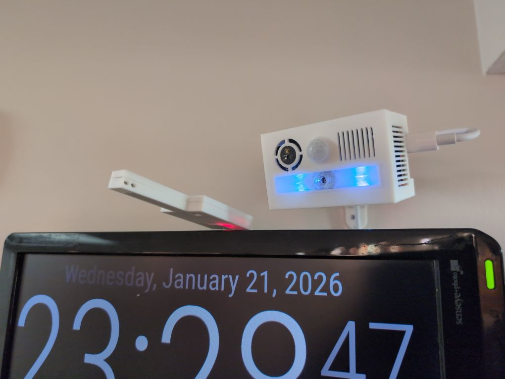
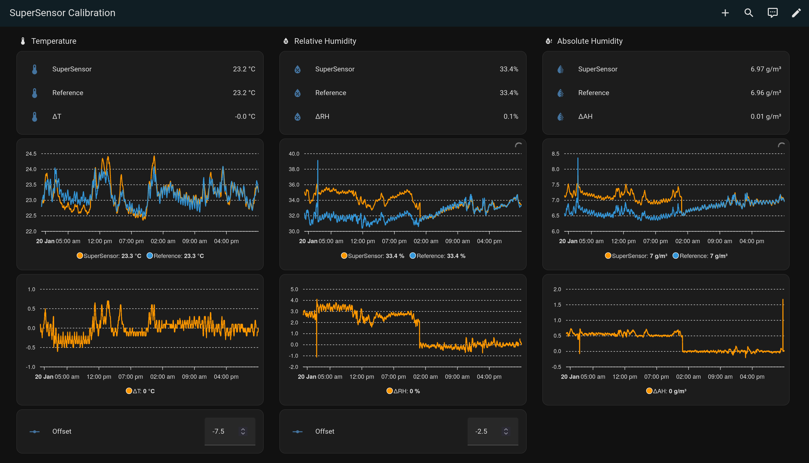

# SuperSensor v3.x Temperature Calibration Dashboard

This page provides and documents a temperature calibration dashboard for use in Home Assistant, in order to calibrate your SuperSensor v3.x devices using a [MicroEnv 2.x sensor](https://github.com/joshuaboniface/microenv).

The MicroEnv provides a reliable, consistent temperature reference to help calibrate the SuperSensor's temperature offset, due to the negative effects of internal heating from the other components. Unlike many discrete temperature probes, the MicroEnv is also based on ESPHome and can be easily integrated into Home Assistant, providing a convenient way to visualize the data for analysis.

## Prerequisites

1. You will need both a MicroEnv 2.x sensor, as well as the SuperSensor, installed in your desired location.

2. The MicroEnv should be placed such that its temperature probe is within about 10cm of the SuperSensor's UESM face, in a roughly similar horizontal and vertical alignment, as in the following picture. Avoid placing the MicroEnv **above** the SuperSensor as this can result in a temperature drift, as can directly attaching the MicroEnv to the SuperSensor case; keep them separate.

   

3. Both devices should be imported into Home Assistant using their default friendly names (to create generic entity IDs); they may be renamed later.

## Helper Entities

You will want to create 3 template helper entities in order to provide sensors for the temperature, relative humidity, and absolute humidity deltas for later graphing. We use very generic names to faciliate easy configuration of multiple SuperSensors, but you can name these whatever you like and simply modify the entity references in the dashboard later.

### "SuperSensor Calibration Temperature Delta"

Create the entity by going to "Settings" -> "Devices & services" -> "Helpers" and clicking "Create helper". Select "Template", and then "Sensor". Enter the following values for the entity.

In the `State` template, replace `XXXXXX` with the 6-digit ID of your SuperSensor to calibrate, and `YYYYYY` with the 6-digit ID of your reference MicroEnv Sensor.

* Name: `SuperSensor Calibration Temperature Delta`
* State: `{{ (states('sensor.supersensor_XXXXXX_sht45_temperature')|float - states('sensor.microenv_sensor_YYYYYY_sht45_temperature')|float)|round(1) }}`
* Unit of measurement: `°C`
* Device class: `Temperature delta` (or `Temperature`)
* State class: `Measurement`

Save the resulting template sensor configuration.

If you need to later modify this template (e.g. to switch out which SuperSensor you are calibrating), select the Helper entity, click the ⚙️  icon, click "Template options", then edit the "State" contents.

### "SuperSensor Calibration Relative Humidity Delta"

Create the entity by going to "Settings" -> "Devices & services" -> "Helpers" and clicking "Create helper". Select "Template", and then "Sensor". Enter the following values for the entity.

In the `State` template, replace `XXXXXX` with the 6-digit ID of your SuperSensor to calibrate, and `YYYYYY` with the 6-digit ID of your reference MicroEnv Sensor.

* Name: `SuperSensor Calibration Relative Humidity Delta`
* State: `{{ (states('sensor.supersensor_XXXXXX_sht45_relative_humidity')|float - states('sensor.microenv_sensor_YYYYYY_sht45_relative_humidity')|float)|round(1) }}`
* Unit of measurement: `%`
* Device class: `Relative Humidity`
* State class: `Measurement`

Save the resulting template sensor configuration.

If you need to later modify this template (e.g. to switch out which SuperSensor you are calibrating), select the Helper entity, click the ⚙️  icon, click "Template options", then edit the "State" contents.

### "SuperSensor Calibration Absolute Humidity Delta"

Create the entity by going to "Settings" -> "Devices & services" -> "Helpers" and clicking "Create helper". Select "Template", and then "Sensor". Enter the following values for the entity.

In the `State` template, replace `XXXXXX` with the 6-digit ID of your SuperSensor to calibrate, and `YYYYYY` with the 6-digit ID of your reference MicroEnv Sensor.

* Name: `SuperSensor Calibration Absolute Humidity Delta`
* State: `{{ (states('sensor.supersensor_XXXXXX_sht45_absolute_humidity')|float - states('sensor.microenv_sensor_YYYYYY_sht45_absolute_humidity')|float)|round(2) }}`
* Unit of measurement: `g⁄m³`
* Device class: `Absolute Humidity`
* State class: `Measurement`

Save the resulting template sensor configuration. You may need to re-edit the Helper entity by selecting it, clicking on the ⚙️  icon, and setting the "Display precision" to `0.00` to properly show the required decimal places, if it does not properly default to this.

If you need to later modify this template (e.g. to switch out which SuperSensor you are calibrating), select the Helper entity, click the ⚙️  icon, click "Template options", then edit the "State" contents.

## Dashboard

Create a new dashboard, edit it, then open the "Raw configuration editor" and paste the following dashboard YAML. This dashboard requires the [`apexcharts-card` HACS addon](https://github.com/RomRider/apexcharts-card).

For every instance of them, replace `XXXXXX` with the 6-digit ID of your SuperSensor to calibrate, and `YYYYYY` with the 6-digit ID of your reference MicroEnv Sensor.

```
views:
  - type: sections
    max_columns: 4
    title: SuperSensor Calibration
    path: supersensor-calibration
    icon: mdi:test-tube
    sections:
      - type: grid
        cards:
          - type: heading
            icon: mdi:thermometer
            heading: Temperature
            heading_style: title
            grid_options:
              rows: auto
          - type: entities
            entities:
              - entity: sensor.supersensor_XXXXXX_sht45_temperature
                name: SuperSensor
              - entity: sensor.microenv_sensor_YYYYYY_sht45_temperature
                name: Reference
              - entity: sensor.supersensor_calibration_temperature_delta
                name: ΔT
          - type: custom:apexcharts-card
            graph_span: 48h
            header:
              show: false
              title: Sensors
              show_states: false
              colorize_states: true
            series:
              - entity: sensor.supersensor_XXXXXX_sht45_temperature
                name: SuperSensor
                stroke_width: 2
              - entity: sensor.microenv_sensor_YYYYYY_sht45_temperature
                name: Reference
                stroke_width: 2
            apex_config:
              chart:
                height: 250px
              xaxis:
                tooltip:
                  enabled: false
              tooltip:
                shared: true
                intersect: false
                fixed:
                  enabled: true
                  position: topLeft
            all_series_config:
              group_by:
                duration: 1min
                func: avg
                fill: last
          - type: custom:apexcharts-card
            graph_span: 48h
            header:
              show: false
              title: Delta
              show_states: false
              colorize_states: true
            series:
              - entity: sensor.supersensor_calibration_temperature_delta
                name: ΔT
                stroke_width: 2
            apex_config:
              chart:
                height: 250px
              legend:
                show: true
                showForSingleSeries: true
              xaxis:
                tooltip:
                  enabled: false
              tooltip:
                shared: true
                intersect: false
                fixed:
                  enabled: true
                  position: topLeft
            all_series_config:
              group_by:
                duration: 1min
                func: avg
                fill: last
          - type: entities
            entities:
              - entity: number.supersensor_XXXXXX_temperature_offset
                name: Offset
      - type: grid
        cards:
          - type: heading
            heading_style: title
            heading: Relative Humidity
            icon: mdi:water-percent
            grid_options:
              rows: auto
          - type: entities
            entities:
              - entity: sensor.supersensor_XXXXXX_sht45_relative_humidity
                name: SuperSensor
              - entity: sensor.microenv_sensor_YYYYYY_sht45_relative_humidity
                name: Reference
              - entity: sensor.supersensor_calibration_relative_humidity_delta
                name: ΔRH
          - type: custom:apexcharts-card
            graph_span: 48h
            header:
              show: false
              title: Sensors
              show_states: false
              colorize_states: true
            series:
              - entity: sensor.supersensor_XXXXXX_sht45_relative_humidity
                name: SuperSensor
                stroke_width: 2
              - entity: sensor.microenv_sensor_YYYYYY_sht45_relative_humidity
                name: Reference
                stroke_width: 2
            apex_config:
              chart:
                height: 250px
              xaxis:
                tooltip:
                  enabled: false
              tooltip:
                shared: true
                intersect: false
                fixed:
                  enabled: true
                  position: topLeft
            all_series_config:
              group_by:
                duration: 1min
                func: avg
                fill: last
          - type: custom:apexcharts-card
            graph_span: 48h
            header:
              show: false
              title: Delta
              show_states: false
              colorize_states: true
            series:
              - entity: sensor.supersensor_calibration_relative_humidity_delta
                name: ΔRH
                stroke_width: 2
            apex_config:
              chart:
                height: 250px
              legend:
                show: true
                showForSingleSeries: true
              xaxis:
                tooltip:
                  enabled: false
              tooltip:
                shared: true
                intersect: false
                fixed:
                  enabled: true
                  position: topLeft
            all_series_config:
              group_by:
                duration: 1min
                func: avg
                fill: last
          - type: entities
            entities:
              - entity: number.supersensor_XXXXXX_humidity_offset
                name: Offset
      - type: grid
        cards:
          - type: heading
            heading: Absolute Humidity
            heading_style: title
            icon: mdi:water-percent-alert
            grid_options:
              rows: auto
          - type: entities
            entities:
              - entity: sensor.supersensor_XXXXXX_sht45_absolute_humidity
                name: SuperSensor
              - entity: sensor.microenv_sensor_YYYYYY_sht45_absolute_humidity
                name: Reference
              - entity: sensor.supersensor_calibration_absolute_humidity_delta
                name: ΔAH
          - type: custom:apexcharts-card
            graph_span: 48h
            header:
              show: false
              title: Sensors
              show_states: false
              colorize_states: true
            series:
              - entity: sensor.supersensor_XXXXXX_sht45_absolute_humidity
                name: SuperSensor
                stroke_width: 2
              - entity: sensor.microenv_sensor_YYYYYY_sht45_absolute_humidity
                name: Reference
                stroke_width: 2
            apex_config:
              chart:
                height: 250px
              xaxis:
                tooltip:
                  enabled: false
              tooltip:
                shared: true
                intersect: false
                fixed:
                  enabled: true
                  position: topLeft
            all_series_config:
              group_by:
                duration: 1min
                func: avg
                fill: last
          - type: custom:apexcharts-card
            graph_span: 48h
            header:
              show: false
              title: Delta
              show_states: false
              colorize_states: true
            series:
              - entity: sensor.supersensor_calibration_absolute_humidity_delta
                name: ΔAH
                stroke_width: 2
            apex_config:
              chart:
                height: 250px
              legend:
                show: true
                showForSingleSeries: true
              xaxis:
                tooltip:
                  enabled: false
              tooltip:
                shared: true
                intersect: false
                fixed:
                  enabled: true
                  position: topLeft
            all_series_config:
              group_by:
                duration: 1min
                func: avg
                fill: last
```

Like the helper template sensors above, if you wish to calibrate additional SuperSensors later, simply edit the dashboard and swap out the SuperSensor IDs.

## Using The Dashboard

The new dashboard will show you both the current values, delta, and graphs of the SHT45 values, as well as the two exposed offset values from the SuperSensor.



To use it, let both sensors collect data for at least 24 hours, and then observe the graphs. You will want to adjust the "Offset" value for both Temperature and Relative Humidity such that the `ΔT` and `ΔRH` lines in the second graph of their respective columns is as centered on zero as possible.

In the above example, the Temperture offset has been properly calibrated to `-7.5` for over 48 hours; notice that the `ΔT` graph is mostly centered around `0.0` with only occasional fluctuations, and that the two entity graphs are closely aligned with each other. This is the ideal scenario. The Humidity offset, in contrast, was configured for only 24 hours, and you can see the previous state with a `ΔRH` that was hovering around `2.5`. Thus, we set the Offset to `-2.5` to bring them in line, and the last 24 hours now show a delta mostly centered around `0.0` and the entity graphs closely aligned as expected. Since Absolute Humidity is calculated from the Temperature and Reltive Humidity, once these are calibrated the Absolute Humidity graph should align as well.

Once you have the SuperSensor calibrated, it can be helpful to leave this dashboard running for at least 48 hours, to confirm that the sensor offsets continue to behave as expected and do not require further adjustment.

If the environmental conditions of the SuperSensor change in any way (it is repositioned, etc.), it is advised to re-run this calibration excercise to ensure the offset does not change.
